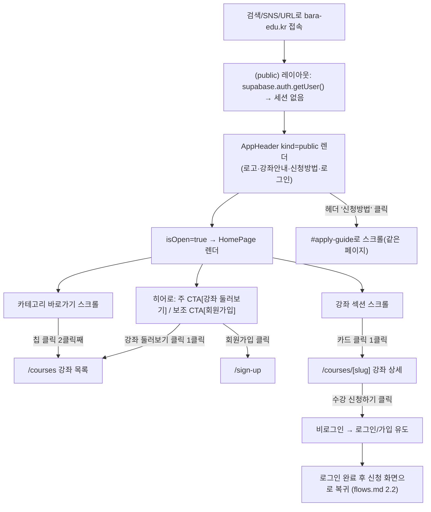
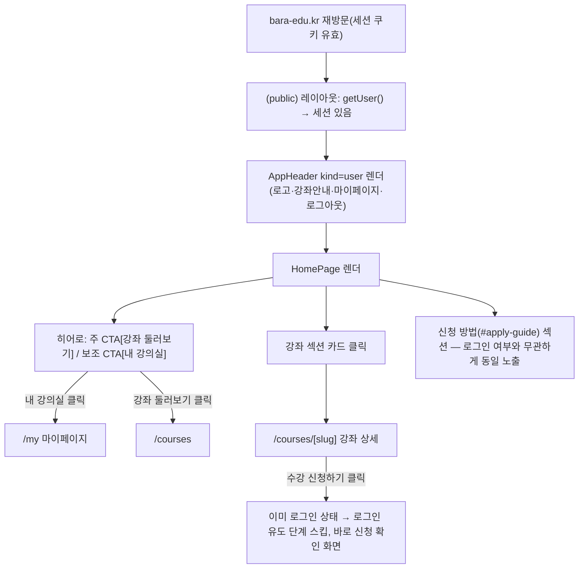

# bara-edu-lms — 홈(메인) 화면 PRD-lite

> **작성자**: Product Owner
> **작성일**: 2026-08-10
> **단계**: Plan (PDCA Phase 1) — 동시 오픈 직전 스코프 보정
> **버전**: v1.0
> **선행 문서**: [bara-edu-lms.plan.md](./bara-edu-lms.plan.md) · [bara-edu-lms.menu-features.md](./bara-edu-lms.menu-features.md) (F-PUB-1 정정) · [bara-edu-lms.flows.md](./bara-edu-lms.flows.md) · [bara-edu-lms.legal-privacy.md](./bara-edu-lms.legal-privacy.md)
> **대체 대상**: [bara-edu-mvp.plan.md](./bara-edu-mvp.plan.md) 3절의 "[x] 메인 홈페이지" — 이 체크는 Google Sheets/Forms 시절 **계획 스코프 표기**이며 구현 완료를 뜻하지 않는다(2026-08-10 확인).

---

## Executive Summary

| 관점 | 내용 |
|------|------|
| **Problem** | LMS 전 기능(가입~강의실~Admin)이 완성됐는데도 **정식 오픈이 불가능**하다. `NEXT_PUBLIC_IS_OPEN=true`로 바꿔도 방문자는 여전히 Coming Soon만 본다 — "처음 만나는 랜딩 홈"이 이 프로젝트에 한 번도 존재한 적이 없다 |
| **Solution** | 이미 구현된 자산(강좌 목록/상세·회원가입·마이페이지·약관 CMS)으로 **곧장 연결되는 얇은 홈 1페이지**를 만든다. 새 데이터 모델·새 페이지를 만들지 않고, 기존 컴포넌트(AppHeader/CourseCard/Badge) 인스턴스 조립으로 끝낸다 |
| **Function UX Effect** | 검색·링크로 처음 들어온 방문자가 첫 화면에서 (1) 무엇을 배울 수 있는지 (2) 어떻게 신청·입금·수강하는지 (3) 실체 있는 기관인지를 스크롤 한 번에 파악하고, **1~2클릭 안에 강좌 상세**로 진입한다 |
| **Core Value** | 홈은 "새 기능"이 아니라 **오픈 게이트 블로커 해소**다. 범위를 늘리지 않고 오픈을 여는 것이 이 문서의 목적이며, 홈을 About/브랜딩/마케팅 페이지로 키우려는 요구는 전부 Won't/Should로 밀어낸다 |

---

## 0. 배경 — 왜 지금 이 문서인가

### 0.1 발견된 사실

| # | 사실 | 근거 |
|---|---|---|
| 1 | `app/page.tsx`는 `isOpen` 값과 **무관하게** 항상 `<ComingSoon />`을 반환한다 (`// TODO: 정식 오픈 후 HomePage 컴포넌트로 교체`) | `app/page.tsx:16-22` |
| 2 | 기능정의서 F-PUB-1의 "기존 MVP 구현 유지"는 **잘못된 전제**였다. 재사용할 MVP 홈 자체가 없다 | `bara-edu-lms.menu-features.md:79` |
| 3 | 헤더의 "신청방법" 링크가 **깨져 있다** — `/#apply-guide`를 가리키는데 홈에 해당 앵커 섹션이 없다 | `components/layout/AppHeader.tsx:25` |
| 4 | 루트 `/`는 `(public)` 라우트 그룹 **밖**이라 `AppHeader`(로그인/마이페이지 전환)가 아니라 Coming Soon 전용 `Header`(로고만)를 쓴다 | `app/page.tsx`, `app/(public)/layout.tsx` |
| 5 | `data/site-config.ts`의 연락처·주소가 **더미값**(`010-0000-0000`, `서울특별시`)이며 법무 문서의 실제 정보(대표전화 010-9025-5093, info@ylia.io, 경기도 광명시 오리로 362 4층)와 불일치한다 | `data/site-config.ts:5-7` vs `bara-edu-lms.legal-terms.md:205-206` |
| 6 | 현재 `Footer`는 "주식회사 일리아 · ylia.io" 한 줄뿐 — 전자상거래법상 표시사항(사업자등록번호·통신판매업 신고번호·대표자·주소)과 약관/처리방침 링크가 없다 | `components/layout/Footer.tsx` |
| 7 | Coming Soon의 사전신청 이메일 수집은 **처리방침에 근거가 없다** — 제1조 수집 항목에 없고, 제5조 위탁자 목록에 Google이 없다 | `bara-edu-lms.legal-privacy.md:37-44, 140-143` |

### 0.2 이 문서의 성격

홈은 "있으면 좋은 기능"이 아니라 **L7(동시 정식 오픈) 마일스톤의 잔여 블로커**다. 따라서 스코프 판단 기준도 "좋은 홈"이 아니라 **"오픈을 막지 않는 최소 홈"**이다. 홈을 계기로 About·후기·B2B·다국어가 딸려 들어오려는 시도는 4절에서 전부 비목표로 되돌린다.

---

## 1. 문제 정의 — 어떤 세그먼트의 어떤 문제를 푸는가

| 세그먼트 | 홈이 없을 때 겪는 문제 | 홈이 풀어야 하는 것 | 대응 요구사항 |
|---|---|---|---|
| **직장인 / 성인 학습자** (30~50대) | 검색·SNS로 `bara-edu.kr`에 도착해도 "여기서 뭘 배울 수 있는가"를 알 수 없다. `/courses`를 직접 알고 있어야만 강좌를 본다 | 첫 화면에서 카테고리와 실제 개설 강좌를 즉시 노출 | H-M2, H-M3, H-M4 |
| **구직 준비생 / 취준자** | 판단 기준 1순위가 "정부지원 되는가 / 얼마인가"인데, 목록 안까지 들어가야 배지를 본다 | 정부지원 과정의 존재와 진입점을 홈에서 알림 | H-M4(배지), H-M6 |
| **시니어 (50대 이상)** | 온라인 신청 절차 자체가 장벽. "신청하면 끝인지, 돈은 언제 어떻게 내는지"를 모르면 전화로 되돌아간다 | 신청→입금→승인→수강 4단계를 홈에서 미리 설명 (+ 큰 글씨/단순 동선) | H-M5, H-M10, H-S2 |
| **경력단절자** | 처음 보는 소규모 교육기관에 이름·연락처·수강료를 맡겨도 되는지 판단 근거가 없다 | 운영 주체·사업자등록·통신판매업 신고·약관/처리방침을 명시 | H-M7, H-M8, H-S1 |
| **해외이주민** | 한국어 안내문이 어려우면 이해가 막힌다 | (다국어는 이연) 이번엔 **쉬운 한국어 카피** 수준으로만 대응 | H-M5 카피 원칙 |
| **B2B (기업 위탁교육)** | 담당자가 문의할 창구를 찾지 못한다 | 대표 연락처 노출로 최소 대응 (전용 섹션은 Won't) | H-M7, H-S2 |
| **재방문 회원** (공통) | 홈에 로그인/마이페이지 진입점이 없으면 강의실 재진입 경로가 URL 기억에 의존한다 | 로그인 상태에 따라 CTA/헤더 전환 | H-M1, H-M2 |

> **원칙**: 위 표에 없는 문제를 푸는 섹션은 이번 홈에 넣지 않는다.

---

## 2. 목표 및 성공지표

### 2.1 지표를 두 층으로 나누는 이유

현재 이 서비스에는 **웹 애널리틱스가 도입되어 있지 않다**. 따라서 "이탈률 40% 이하" 같은 목표는 지금 세워도 검증할 수단이 없다. 오픈 게이트 판정은 **결정론적으로 검증 가능한 A층 지표**로만 하고, 행동 지표는 계측 도입(H-S3) 후 **기준선(baseline) 수집 → 목표 재설정** 순서로 간다. 근거 없는 수치를 목표로 박지 않는다.

### 2.2 A층 — 오픈 게이트 판정 지표 (Go/No-Go)

| 지표 | 목표 | 측정 방법 | 근거 |
|---|---|---|---|
| 홈 → 강좌 상세 도달 클릭 수 | **≤ 3클릭** (홈 강좌카드 클릭 = 1클릭 / 카테고리 경유 = 2클릭) | QA 수동 경로 측정 | mvp.plan.md 1.3 성공기준 승계 |
| 홈 → 회원가입 도달 | **1클릭** | QA | 신규 학습자 전환 동선 |
| 홈 → 신청방법(#apply-guide) 도달 | **1클릭** (헤더 링크 정상 동작) | QA | 현재 깨진 링크 해소 |
| 홈 내부 링크 무결성 | **깨진 링크 0건** | 링크 점검 | 오픈 직후 신뢰도 직결 |
| 반응형 | 360px / 768px / 1440px 레이아웃 깨짐 **0건** | QA 크로스 체크 | lms.plan.md 1.3 |
| 홈 LCP (모바일 4G 기준) | **≤ 2.5s** | Lighthouse | 시니어·모바일 유입 비중 가정, 무거운 히어로 이미지 차단 근거 |
| 접근성 | 본문 ≥ 16px, 대비 AA, 키보드 포커스 가시, 이미지 alt 100% | QA | 시니어 세그먼트 |
| 법정 표시사항 | 푸터에 상호·대표자·사업자등록번호·통신판매업 신고번호·주소·연락처·약관/처리방침 링크 **전부 노출** | security-officer 확인 | 전자상거래법 제10조 |
| 개인정보 수집 채널 | 홈에서 **처리방침에 근거 없는 개인정보 수집 0건** | security-officer 확인 | 5절 결정 |

### 2.3 B층 — 오픈 후 측정 대상 (계측 도입 전제, 목표는 가설)

| 지표 | 초기 가설값 | 처리 |
|---|---|---|
| 홈 방문 → 강좌 관련 페이지(`/courses`, `/courses/[slug]`) 이동 비율 | 40% | **가설**. 오픈 후 2주 기준선 수집 후 확정. 유사 평생교육기관 벤치마크는 researcher에게 검증 요청 |
| 강좌 상세 → 수강신청 완료율 | **> 70%** | 기존 성공기준 유지 (mvp.plan.md 1.3). 홈은 상단 유입 기여로만 평가 |
| 홈 단일 페이지 이탈률 | 미설정 | 기준선 없이 목표 설정 금지 |

> 측정하지 않기로 한 것: 체류시간, PV — 홈이 얇은 경유 페이지라 길게 머무는 게 좋은 신호가 아니다.

---

## 3. 요구사항

우선순위: **Must**(이게 없으면 `IS_OPEN=true` 전환 불가) / **Should**(오픈 직후 2주 내) / **Could**(재검토 후보)

### 3.1 Must — 오픈 게이트

| ID | 요구사항 | 상세 | 대상 세그먼트 | 연결 지표 |
|---|---|---|---|---|
| **H-M1** | 홈 라우팅 전환 | `isOpen=true` → `<HomePage />`, `false` → `<ComingSoon />` (롤백 스위치 보존). 홈도 `(public)` 레이아웃과 **동일한 `AppHeader`**(세션에 따라 로그인/마이페이지 전환)를 사용한다 — 현재 루트는 로고만 있는 Coming Soon 전용 Header라 로그인 진입점이 없다. `RecoveryRedirect`는 두 경로 모두 유지 | 전체·재방문 회원 | 1클릭 도달 |
| **H-M2** | 히어로 섹션 | 슬로건 **"배움으로 새로운 나를 창조합니다"** 유지 + 한 문장 설명. 주 CTA **[강좌 둘러보기] → `/courses`**, 보조 CTA **[회원가입] → `/sign-up`** (로그인 상태면 **[내 강의실] → `/my`**로 치환). CTA는 화면 최상단 1스크롤 내 노출 | 전체 | 1~3클릭 |
| **H-M3** | 카테고리 바로가기 | `getCategoryTree()`의 **활성 depth=1 카테고리**를 `/courses?category=<id>`로 링크. **하드코딩 금지** — Admin 카테고리 관리(F-ADMCAT-1)와 항상 일치해야 하며, 하드코딩 시 운영자가 카테고리를 바꾸는 순간 홈이 거짓 정보를 노출한다 | 직장인, 취준자 | 2클릭 |
| **H-M4** | 강좌 섹션 | `getPublicCourses()` 결과 **상위 6건(최신순 = 기존 `created_at desc`)** 카드 노출. `/courses`의 카드 UI(카테고리/정부지원/마감 배지) **재사용**, 하단 [전체 강좌 보기]. **강좌 0건이면 섹션을 숨기고** "강좌를 준비하고 있어요" 안내 (오픈 직후 빈 그리드 방지) | 직장인, 취준자, 시니어 | 1클릭 도달 |
| **H-M5** | 신청 방법 섹션 (`id="apply-guide"`) | 4단계: ① 회원가입 → ② 강좌 신청 → ③ 무통장입금(**기한 3일**) → ④ 운영자 승인 후 강의실 이용. 근거: flows.md Q2. 헤더 "신청방법" 링크의 목적지이며 이 섹션이 없으면 **깨진 링크로 오픈**하게 된다. 카피는 쉬운 한국어(해외이주민·시니어 고려) | 시니어, 해외이주민, 전체 | 신청 완료율 >70% |
| **H-M6** | 정부지원 안내 (경량) | 안내 블록 1개 + `/courses` 링크(정부지원 배지로 식별). **전용 페이지 없음**. 문구는 "환급 확정/지원 자격 보장" 같은 단정 표현 **금지** — 실제 지정 과정 확인 전까지 과장광고 리스크. **정부지원 강좌가 0건이면 섹션 자체를 노출하지 않는다** (Q2 확인 전제) | 취준자, 경력단절자 | — |
| **H-M7** | 신뢰 요소 / 푸터 확장 | 상호 **바라 평생교육원**, 운영사 **주식회사 일리아**, 대표 **최종훈**, 사업자등록번호 **832-86-03446**, 통신판매업 신고번호 **제2026-경기광명-0607호**, 주소 **경기도 광명시 오리로 362 4층**, 대표전화·이메일 + **[이용약관] `/legal/terms` / [개인정보처리방침] `/legal/privacy`**(처리방침은 굵게 강조). 전 페이지 공통 적용 | 경력단절자, B2B, 전체 | 법정 표시사항 |
| **H-M8** | 사이트 정보 단일 출처 정정 | `data/site-config.ts`의 더미 연락처/주소를 실제 값으로 교체하거나, 법무 문서 값을 참조하도록 통일. **불일치 상태로 오픈 금지** | 전체 | 법정 표시사항 |
| **H-M9** | 홈 SEO 메타 | `metadata`(title/description/OG 이미지) + Organization JSON-LD. `isOpen=false`일 때의 인덱싱 정책과 오픈 시 해제 여부 확인 | 신규 유입 전체 | B층 유입 |
| **H-M10** | 반응형 · 접근성 최소선 | 360~1440px, 본문 16px 이상, 대비 AA, 키보드 포커스, alt 텍스트 | 시니어, 모바일 | 2.2 지표 |
| **H-M11** | 사전신청 이메일 폼 제거 | 오픈 화면(`HomePage`)에 이메일 수집 폼을 두지 않으며, Coming Soon의 사전신청도 오픈 시점에 비활성화한다 (5절 결정) | 전체 | 개인정보 수집 0건 |

### 3.2 Should — 오픈 직후 2주 내

| ID | 요구사항 | 근거 / 비고 |
|---|---|---|
| **H-S1** | 브랜드 소개 짧은 블록 (히브리어 בָּרָא = '창조하다' 2~3줄) | 신뢰 요소지만 강좌 탐색 동선보다 아래. About 페이지 대신 **홈 한 블록**으로 갈음 |
| **H-S2** | 문의 CTA (`tel:`, `mailto:`) | B2B·시니어의 전화 선호 대응. Q1(대표전화 공개 여부) 확정 후 |
| **H-S3** | 방문 계측 도입 (GA4 등) | 2.3 B층 지표의 전제. 도입 시 처리방침에 **분석도구/쿠키 고지 추가 필요** (security-officer 선행) |
| **H-S4** | "개강 임박" 강좌 정렬·표시 | `courses`에 개강일 컬럼이 **없다** → 스키마 확장 필요. 오픈 게이트에 넣으면 DB 변경이 오픈을 지연시키므로 Should |
| **H-S5** | FAQ 3~5문항 아코디언 (입금·환불·수료증) | 문의 부하 감소. 답변은 약관/환불정책과 **문구 일치** 필요 |

### 3.3 Could — 데이터·자산 확보 후 재검토

| ID | 요구사항 | 착수 조건 |
|---|---|---|
| **H-C1** | 수강 후기 / 수료생 인터뷰 | 실제 수료자 발생 이후. **창작 후기 금지** |
| **H-C2** | 인기 강좌 섹션 | 4절 참조 (신청 100건 누적 이후 재검토) |
| **H-C3** | 히어로 배경 이미지·영상 | 브랜드 자산 확보 + LCP 2.5s 유지 검증 시 |
| **H-C4** | 제휴·파트너 로고 | 제휴처 확정 시 |
| **H-C5** | 개인화 추천 | 회원·수강 데이터 축적 이후 |

### 3.4 우선순위 스코어 (판단 근거)

| 항목 | 오픈 차단성 | 세그먼트 폭 | 구현 비용 | 판정 |
|---|:---:|:---:|:---:|:---:|
| 홈 라우팅/히어로/CTA (H-M1·M2) | 상 | 전체 | 하 | **Must** |
| 신청방법 앵커 (H-M5) | 상 (깨진 링크) | 전체 | 하 | **Must** |
| 푸터 법정 표시 (H-M7·M8) | 상 (법적) | 전체 | 하 | **Must** |
| 카테고리·강좌 노출 (H-M3·M4) | 중 (빈 홈 방지) | 전체 | 하 (기존 쿼리 재사용) | **Must** |
| 사전신청 폼 제거 (H-M11) | 상 (법적) | 전체 | 하 | **Must** |
| FAQ·브랜드·문의 (H-S1·S2·S5) | 하 | 중 | 중 | Should |
| 개강임박 (H-S4) | 하 | 중 | **상 (스키마 변경)** | Should |
| 후기·인기강좌 (H-C1·C2) | 없음 | 중 | 상 (데이터 부재) | Could |

---

## 4. 비목표 (Won't do — 이번 홈 범위 제외)

| 제외 항목 | 이유 | 재검토 시점 |
|---|---|---|
| **인기/추천 강좌 (신청 수 기준)** | `courses`에 인기도/추천 컬럼이 없고, 신청 수 집계는 `enrollments`의 공개 집계를 요구해 RLS·개인정보 관점 부담이 생긴다. 게다가 **오픈 직후 신청 데이터는 0**이라 "인기"가 성립하지 않는다 → 최신순으로 대체 | 강좌 20건 / 신청 100건 누적 시 |
| **About 상세 페이지 · 오시는 길** | 기존 2차 이연 유지. 홈 1블록(H-S1)으로 충분 | 오프라인 방문 문의 발생 시 |
| **B2B 전용 섹션 / 문의 폼** | 문의 폼은 **또 하나의 개인정보 수집 채널** — 처리방침 개정·보관·파기 절차가 딸려온다. 지금은 대표 연락처 노출로 대응 | B2B 문의 실제 유입 확인 후 |
| **정부지원과정 전용 페이지** | 기존 이연 유지 + 실제 지정 과정 확정 전 상세 안내는 과장광고 리스크 | 지정 과정 확정 시 |
| **다국어 지원** | 기존 이연 유지. 해외이주민 대응은 쉬운 한국어로 부분 완화 | 별도 안건 |
| **후기·평점 시스템** | 콘텐츠 부재 + 조작 유혹. 신뢰 요소는 사업자정보로 대체 | 수료자 발생 후 |
| **홈 검색바 / 필터 고도화** | 강좌 수가 적어 카테고리 칩으로 충분. 기존 이연 유지 | 강좌 30건 이상 |
| **팝업·배너 공지, 뉴스레터 구독** | 5절과 동일한 개인정보/동의 근거 문제 + 첫 화면 전환 방해 | 마케팅 동의 체계 수립 후 |
| **홈 콘텐츠 CMS화(운영자 편집)** | 과설계. 홈에서 변하는 정보(카테고리·강좌)는 이미 Admin과 실시간 연동된다 | 홈 카피 변경 요청 반복 시 |
| **온라인 결제(PG) 안내 문구** | 아직 무통장입금 운영. 있지도 않은 결제수단 안내 금지 | PG 계약 후 |

---

## 5. 사전신청 이메일 수집 폼 — 오픈 후 유지 여부 (PO 판단)

### 결정: **정식 오픈과 동시에 폐지한다 (Won't do)**

### 근거

1. **목적이 소멸한다.** 이 폼은 "오픈 전 대기자 확보" 채널이다. 오픈 후 정식 채널은 회원가입(Supabase Auth)이며, 두 채널이 병존하면 **로그인도 탈퇴도 열람권 행사도 불가능한 "이메일만 있는 사람" 풀**이 생긴다. 관리 주체가 없는 개인정보 사각지대다.

2. **법적 리스크가 실재한다** (security-officer 지적의 실체):
   - 처리방침 제1조 수집 항목에 **사전신청 이메일이 없다** → 미고지 수집
   - 제5조 위탁자 목록은 Supabase·AWS뿐, **Google(Apps Script/Sheets)이 없다** → 처리 위탁 미고지 + 국외 이전 고지 누락 가능성
   - 유지하려면 처리방침 개정 + 수집 동의 UI + 수신거부·파기 절차 + 위탁 관리·감독이 전부 따라와야 한다. **홈 섹션 하나를 위해 감수할 비용이 아니다.**

3. **기술적으로 취약하다.** 인증 없이 클라이언트에서 외부 Apps Script로 직접 POST하는 구조(`components/home/ComingSoon.tsx:26-31`)로, 엔드포인트가 노출되고 봇 대량 등록을 막을 수단이 없다. 오픈 트래픽이 들어오는 화면에 둘 구조가 아니다.

4. **전환 목표와 경쟁한다.** 히어로의 1차 목표는 [강좌 둘러보기]·[회원가입]이다. 이메일 입력 폼은 같은 화면에서 이 두 CTA의 주의를 나눠 가진다.

### 부수 조치

| # | 조치 | 담당 | 우선순위 |
|---|---|---|---|
| 1 | `HomePage`에 이메일 수집 폼 미포함 | developer | Must (H-M11) |
| 2 | `ComingSoon`은 롤백용으로 유지하되, **오픈 시점에 폼 제출을 비활성화**하고 Apps Script 엔드포인트를 해제 | developer | Must |
| 3 | **이미 수집된 이메일 처리**: 광고성 정보 수신 동의 근거가 없으므로(정보통신망법 제50조) 오픈 안내 메일 발송도 안전하지 않다. **권고안 = 발송하지 않고 파기 + 파기 기록 남김.** 발송을 원할 경우 security-officer 사전 판단 필수 | security-officer → 대표 | Must |
| 4 | 향후 마케팅 이메일이 필요하면 **회원가입 시 선택 동의(마케팅 수신) 항목 신설 → 처리방침 개정 → 구현** 순서로 별도 안건화. Apps Script 재사용 금지 | PO | Should |

---

## 6. 오픈 게이트 (Definition of Done)

`NEXT_PUBLIC_IS_OPEN=true` 전환은 아래를 **전부** 충족한 뒤에만 승인한다.

- [x] 3.1 Must 항목 H-M1~H-M11 코드 구현 완료 (2026-08-10, `app/(public)/page.tsx` + `components/home/*` + `Footer.tsx` 재설계). H-M6(정부지원 안내)은 PO 결정으로 이번 범위 제외.
- [x] 내부 링크 무결성 — 헤더 "신청방법"(`/#apply-guide`)과 `ApplyGuideSection`의 `id="apply-guide"` 철자 일치 확인(코드 리뷰)
- [ ] 360 / 768 / 1440px 반응형 확인, Lighthouse LCP ≤ 2.5s — **미실행**(실기기/Lighthouse 측정 필요)
- [ ] 푸터 법정 표시사항 + 약관/처리방침 링크 노출 — **privacy-security-officer 재확인 미완료**(리뷰 에이전트가 계정 사용한도로 중단됨, 재시도 필요)
- [ ] 홈에 처리방침 근거 없는 개인정보 수집 없음 — **privacy-security-officer 재확인 미완료**(위와 동일 사유)
- [ ] 사전신청 기수집 이메일 처리 완료 (5절 부수조치 3) — **미착수**(운영 조치, 코드 변경 아님)
- [ ] 실제 공개 강좌 최소 3건 등록 (Q6) — **미착수**, 현재 `/courses`에 seed 데이터 3건이 그대로 남아있음
- [ ] qa-reviewer 리뷰 통과 — **미완료**(리뷰 에이전트가 계정 사용한도로 중단됨, 재시도 필요)
- [ ] **PO 최종 승인(F9)** → 이후 `IS_OPEN=true` 및 스모크 테스트

---

## 7. 열린 질문 (확인 필요 — 임의 결정 금지)

| Q | 내용 | 담당 | 권장안 |
|---|---|---|---|
| Q1 | 푸터/문의에 노출할 대표전화 — `010-9025-5093`은 개인 번호 성격인데 그대로 공개할 것인가 | 대표 | 법정 표시사항이므로 공개하되, 별도 대표번호가 있으면 교체 |
| Q2 | 실제 운영 중인 **정부지원 지정 과정**이 있는가 / 표기 가능한 문구 범위 | 대표 | 없으면 H-M6 섹션 제외. 있으면 지정 근거 명칭만 사실대로 표기 |
| Q3 | 히어로용 브랜드 이미지 자산 보유 여부 | 대표 / ui-ux-designer | 없으면 타이포 + 브랜드 컬러 색면으로 처리 (LCP 유리) |
| Q4 | GA4 등 계측 도구 도입 여부·시점 | marketer → security-officer | 오픈 직후 도입, 처리방침 개정과 동시에 |
| Q5 | 사전신청으로 이미 수집된 이메일 **건수·보관 위치·파기 방법** | security-officer | 5절 부수조치 3 |
| Q6 | 오픈 시점 공개 강좌 등록 건수 | 대표 / 운영 | 최소 3건 — 0~1건이면 홈이 빈 껍데기가 되어 오픈 효과가 사라짐 |
| Q7 | 유사 평생교육기관 홈 → 강좌 진입률 벤치마크 | researcher | 2.3 가설값 검증용 |

---

## 8. 문서 정합성 조치 (Do 단계 문서 동기화 원칙)

| 대상 문서 | 조치 | 담당 |
|---|---|---|
| `bara-edu-lms.menu-features.md` | F-PUB-1을 **F-PUB-1a(IS_OPEN 토글)** / **F-PUB-1b(메인 홈 섹션 — 본 문서 3.1)**로 분리하고 "기존 MVP 구현 유지" 문구 삭제 | service-planner |
| `bara-edu-mvp.plan.md` | 상단에 **Superseded(폐기)** 안내 추가 — 3절 체크박스는 계획 스코프 표기이지 구현 완료가 아님 | PO |
| `bara-edu-lms.flows.md` | 홈 진입 플로우(첫 방문 / 재방문 회원) 추가 | service-planner |
| `bara-edu-lms.design.md` | 홈 화면 구성·컴포넌트 매핑 추가 (신규 컴포넌트 최소화 원칙 명시) | ui-ux-designer |
| `bara-edu-lms.legal-privacy.md` | 사전신청 폐지 결정 반영 (개정 불필요 확인) / GA4 도입 시에만 개정 | security-officer |

---

## 9. Next Step (핸드오프)

```
1) service-planner : 홈 섹션 순서·카피 상세, 신청방법 4단계 문구, 홈 진입 플로우
2) ui-ux-designer  : Figma F1~F8 — 홈 화면 (AppHeader/CourseCard/Badge/Button 기존 컴포넌트 인스턴스 재사용, 신규 컴포넌트 최소화)
3) PO              : F9 디자인 리뷰 및 개발 착수 승인  ← 이 승인 전 developer 착수 불가
4) publisher/developer : HomePage 구현 + Footer 확장 + site-config 정정
5) privacy-security-officer : 푸터 법정표시·처리방침 링크·사전신청 폐지 확인
6) qa-reviewer     : 오픈 게이트 체크리스트(6절) 검증
7) project-manager : 위 순서를 L7 잔여 일정으로 편성
```

> Figma 게이트 F1~F8 완료 전에는 F9 승인을 진행하지 않으며, F9 승인 전 개발 착수는 승인되지 않는다 (ceo-advisor 판단 기준 3).

---

## 부록 — service-planner 산출물 (2026-08-10)

> **작성자**: Service Planner
> **입력**: 본 문서 3절(H-M1~M11)·4절(비목표)·9절(Next Step) + PO 확정 사항(정부지원 섹션 제외/대표전화 공개/브랜드 이미지 없음/강좌 데이터는 seed)
> **성격**: PO 문서를 대체하지 않고 "무엇을"을 "어떻게(화면·상태·카피·플로우)"로 구체화. ui-ux-designer가 Figma 착수 시 그대로 입력값으로 쓴다.

### PO 결정사항 반영 메모

| PO 결정 | 본 부록에서의 처리 |
|---|---|
| 정부지원 실제 지정 과정 없음 → H-M6 제외 | 10.1 섹션 순서에서 H-M6을 "제외"로 명시. 단, **카테고리 바로가기(H-M3)의 "정부지원" 칩과 강좌 카드의 "정부지원" 배지는 이번 제외 대상이 아니다** — 이 둘은 `categories`/`courses.government_support` 데이터가 이미 존재하면 자동 노출되는 기존 F-PUB-2/F-ADMCAT 기능이며, H-M6은 그 위에 얹는 "전용 안내 블록 1개"만 가리킨다. 두 개념을 혼동하지 않도록 11.3에 별도 표기 |
| 대표전화 010-9025-5093 노출 가능 (Q1) | H-S2 문의 CTA·푸터 카피에 그대로 반영 (12.4, 12.5) |
| 히어로 이미지 자산 없음 (Q3) | 12.1 카피를 타이포그래피 전용으로 작성. 이미지 관련 alt·레이아웃 요구사항 없음 |
| 현재 `/courses` 강좌 3건은 seed, 오픈 전 실제 강좌로 교체 | 화면 정의서(11절)는 "강좌가 정상적으로 채워진 상태"를 정상 케이스로 설계하고, 0건/1~2건은 엣지케이스로 별도 표기 |

---

## 10. 홈 섹션 구성 확정 (스크롤 순서)

### 10.1 섹션 순서표

| 순서 | 섹션 | anchor/id | 우선순위 | PRD 근거 | 비고 |
|:---:|---|---|:---:|---|---|
| — | AppHeader (전역, 섹션 아님) | — | Must | H-M1 | `(public)` 레이아웃의 `AppHeader`를 그대로 사용. 홈 전용 헤더를 새로 만들지 않는다 |
| 1 | 히어로 | `#hero` (선택) | Must | H-M2 | 슬로건 고정, CTA 2개 |
| 2 | 카테고리 바로가기 | `#categories` | Must | H-M3 | `getCategoryTree()` 데이터 기반, 하드코딩 금지 |
| 3 | 강좌 섹션 | `#courses` | Must | H-M4 | `getPublicCourses()` 상위 6건 |
| 4 | 신청 방법 | `#apply-guide` | Must | H-M5 | 헤더 "신청방법" 링크의 실제 목적지. **id 철자가 헤더 링크(`/#apply-guide`)와 정확히 일치해야 함** |
| 5 | 브랜드 소개 | `#about` (선택) | Should | H-S1 | 오픈 게이트 아님. 개발 리소스가 부족하면 이번 릴리스에서 생략 가능(생략해도 6절 DoD 미충족 아님) |
| 6 | 문의 | `#contact` (선택) | Should | H-S2 | Q1 해결로 카피는 확정했으나 여전히 Should — 5번과 마찬가지로 생략 가능 |
| (제외) | ~~정부지원 안내~~ | — | — | H-M6 | **PO 결정(2026-08-10)으로 이번 홈 범위에서 제외.** 향후 실제 지정 과정이 생기면 별도 기획 문서로 재개 |
| — | Footer (전역) | — | Must | H-M7·M8 | 전 페이지 공통. 홈만의 특수 푸터 없음 |

> **원칙**: 5·6번(Should)을 이번 릴리스에 넣을지는 개발 일정에 달려 있다 — 넣지 않아도 `IS_OPEN=true` 전환(6절 DoD)에는 영향 없다. 단, 넣기로 했다면 12절 카피를 그대로 쓴다(임의 카피 생성 금지).

### 10.2 헤더 "신청방법" 링크와 섹션 순서의 관계

현재 `AppHeader`(`components/layout/AppHeader.tsx:25`)는 `kind='public'`일 때만 "신청방법" 링크를 보여주고 `/#apply-guide`로 연결한다. `kind='user'`(로그인 상태)일 때는 이 링크 자리가 "마이페이지"로 대체된다 — **이는 기존 컴포넌트 설계이며 이번 홈 작업으로 바꾸지 않는다.** 즉 로그인 회원은 헤더에서 신청방법으로 바로 가는 링크가 없지만, 홈 페이지 안에 스크롤해서 내려가면 4번 섹션은 로그인 여부와 무관하게 항상 노출된다(13절 플로우 참고).

---

## 11. 섹션별 화면 정의서

> 표 형식: 구성요소 / 데이터 소스 / 상태(정상·로딩·빈값·에러) / 동작. `/courses`(`app/(public)/courses/page.tsx`)와 동일한 쿼리·컴포넌트 패턴을 재사용하고, 새 상태 처리 로직이 필요한 곳만 별도 명시했다.

### 11.1 히어로 섹션

| 구성요소 | 데이터 소스 | 상태 | 동작 |
|---|---|---|---|
| 슬로건 + 설명문 | 정적 카피(12.1) | 정상 상태만 존재(외부 데이터 의존 없음) | 없음(텍스트) |
| 주 CTA `[강좌 둘러보기]` | 정적 라우트 `/courses` | 항상 동일(로그인 여부 무관) | 클릭 시 `/courses` 이동 |
| 보조 CTA | 세션 여부: `(public)/layout.tsx`의 `supabase.auth.getUser()` | **비로그인**: `[회원가입]` → `/sign-up` / **로그인**: `[내 강의실]` → `/my` | 클릭 시 각 경로 이동 |
| 세션 조회 실패(Supabase 장애) | `getUser()` 에러 | **에러**: 현재 `(public)/layout.tsx`는 에러를 캐치하지 않음 → 미로그인으로 취급되어 `kind='public'` 폴백 (Supabase JS 클라이언트가 네트워크 에러 시 `user: null` 반환하는 기본 동작에 의존) | 화면이 깨지지 않고 비로그인 상태로 안전하게 표시됨(fail-safe). **developer 확인 필요**: 실제로 예외가 throw되는 경우가 있는지 점검 |

### 11.2 카테고리 바로가기 섹션

| 구성요소 | 데이터 소스 | 상태 | 동작 |
|---|---|---|---|
| 카테고리 칩 목록 | `getCategoryTree()` → `depth === 1 && isActive` 필터 | **정상**: 1개 이상 | 클릭 시 `/courses?category=<id>` 이동 |
| | | **빈값**: 활성 depth=1 카테고리 0개 (Admin이 전부 비활성화한 극단적 상황) | 섹션 전체를 렌더링하지 않음(숨김). 별도 안내 문구 없음 — 카테고리 없음은 발생 자체가 운영 실수이므로 조용히 숨기고 강좌 섹션으로 자연스럽게 이어지게 함 |
| | | **로딩**: 서버 컴포넌트이므로 클라이언트 스피너 없음(SSR 완료 후 렌더) | — |
| | | **에러**: `getCategoryTree()`가 throw(Supabase 장애) | 11.6 "쿼리 실패 공통 정책" 참조 |

> **개발 시 확인 필요(신규 발견)**: `getCategoryTree()`는 `is_active` 컬럼을 select는 하지만 쿼리 자체에서 `.eq('is_active', true)`로 거르지 않는다(`lib/supabase/queries.ts:52-62`). 게다가 현재 `/courses` 페이지도 `depth === 1` 조건만 걸고 `isActive`는 확인하지 않는다(`app/(public)/courses/page.tsx:14`). H-M3 요구사항("활성 depth=1 카테고리")대로라면 **홈은 `isActive` 필터를 반드시 넣어야** 하고, 그러면 `/courses`와 노출 카테고리 집합이 달라지는 모순이 생긴다. → **developer에게 전달**: 홈만 필터링하지 말고 `/courses`도 동일하게 `isActive` 필터를 추가해 두 화면의 카테고리 노출 기준을 통일할 것을 권고(범위 확장이 부담되면 최소한 이 불일치를 PO/qa-reviewer에게 알릴 것).

### 11.3 강좌 섹션

| 구성요소 | 데이터 소스 | 상태 | 동작 |
|---|---|---|---|
| 강좌 카드 그리드(최대 6장) | `getPublicCourses()`(정렬 `created_at desc`) 상위 6건 + `getApprovedSeatsTaken(courseIds)` | **정상**: 1건 이상 | 카드 클릭 시 `/courses/[slug]` 이동(1클릭 도달) |
| 카테고리 배지 | `getCategoryTree()`에서 `course.categoryId` 이름 조회 | 정상 | 텍스트만 표시, 클릭 불가(카드 전체가 링크) |
| 정부지원 배지 | `course.governmentSupport === true` | 정상/없음(배지 미표시) | H-M6 제외와 무관하게 계속 노출(위 "PO 결정사항 반영 메모" 참고) |
| 마감 배지 | `seatsTaken[course.id] >= course.seats` | 정상/없음 | 배지만 표시, 카드는 여전히 클릭 가능(상세에서 최종 확인) — `/courses`와 동일 정책 |
| 썸네일 이미지 | — | **해당 없음** | 현재 `courses` 테이블·`/courses` 카드 UI 어디에도 썸네일 필드/이미지가 없다(`lib/supabase/queries.ts` `CourseRow`에 `thumbnail` 없음). 홈도 텍스트 카드로 그대로 재사용하며 **이번에 이미지 요소를 새로 도입하지 않는다**(신규 컴포넌트 최소화 원칙). 썸네일 로드 실패 케이스는 현재 스코프에 존재하지 않음 |
| 빈 상태 | `getPublicCourses()` 결과 0건 | **빈값** | 섹션 제목("지금 개설된 강좌")은 유지하고, 카드 그리드 자리에 안내 문구 1줄만 표시: "강좌를 준비하고 있어요. 곧 새로운 소식으로 찾아뵐게요." `[전체 강좌 보기]` 버튼은 **숨김**(가봐야 빈 목록이라 혼란 방지). ※ 6절 DoD에 "실제 공개 강좌 최소 3건"이 있어 정상 운영 중에는 발생하지 않아야 하는 방어적 케이스 — **확인 요청**: 이 처리 방식(그리드만 숨기고 섹션은 유지)이 PO 의도와 맞는지 1줄 컨펌 부탁 |
| 1~5건만 있는 경우 | 동일 | **정상 케이스의 부분집합** | 그리드는 있는 만큼만(1~5장) 표시. 6장을 채우기 위한 더미 카드 삽입 금지 |
| `[전체 강좌 보기]` 버튼 | 정적 라우트 | 강좌 1건 이상일 때만 노출 | 클릭 시 `/courses` 이동 |
| 로딩 | — | 서버 컴포넌트, 클라이언트 스피너 없음 | — |
| 에러 | `getPublicCourses()` 또는 `getApprovedSeatsTaken()` throw | **에러** | 11.6 참조 |

### 11.4 신청 방법 섹션 (`#apply-guide`)

| 구성요소 | 데이터 소스 | 상태 | 동작 |
|---|---|---|---|
| 섹션 제목·부제 | 정적 카피(12.2) | 정상 고정 | — |
| 4단계 스텝 카드(①~④) | 정적 카피(12.2). **flows.md 6절 Q2(입금 기한 3일, 초과 시 자동 만료) 문구와 100% 일치해야 함** | 정상 고정(외부 데이터 의존 없음) | 클릭 요소 없음(안내 전용). 이 섹션 자체에 CTA 버튼을 넣지 않는다 — 실제 신청은 `/courses/[slug]`에서 시작하므로 여기서 `[강좌 보러가기]` 보조 링크 1개만 두는 것을 권장(선택) |
| 앵커 스크롤 | `id="apply-guide"` | 정상: 헤더 "신청방법" 클릭 → 같은 페이지면 부드러운 스크롤, 다른 페이지(`/courses` 등)에서 클릭하면 `/#apply-guide`로 **페이지 이동 후** 해당 위치로 스크롤 | 브라우저 기본 해시 스크롤 동작에 의존. **개발 확인 필요**: Next.js App Router에서 다른 라우트→`/`+hash 이동 시 스크롤 위치가 정확히 맞는지(레이아웃 시프트로 밀리는 경우 있음) QA 항목에 추가 |

### 11.5 브랜드 소개(H-S1, Should) / 문의(H-S2, Should)

| 구성요소 | 데이터 소스 | 상태 | 동작 |
|---|---|---|---|
| 브랜드 소개 텍스트 2~3줄 | 정적 카피(12.3) | 정상 고정 | 클릭 요소 없음 |
| 문의 전화 버튼 | 정적 값(`010-9025-5093`, Q1 확정) | 정상 고정 | `tel:01090255093` — 모바일에서 탭하면 전화 연결, PC에서는 번호만 노출(클릭 시 동작 없어도 무방) |
| 문의 이메일 버튼 | 정적 값 | 정상 고정, **단 값 확정 필요** | `mailto:info@ylia.io` — 아래 "신규 발견" 참고 |

> **신규 발견(H-M8과 연결)**: `data/site-config.ts`의 `email`은 현재 `'info@bara-edu.kr'`이고, 법무 문서(`bara-edu-lms.legal-terms.md:206`, 환불 조항 `:120`)에 명시된 실제 고객센터 이메일은 `info@ylia.io`다. H-M8 "사이트 정보 단일 출처 정정" 작업 시 이 이메일도 함께 맞출 것을 developer에게 전달한다. 홈의 문의 섹션·푸터는 **법무 문서 값(`info@ylia.io`)을 기준으로 카피를 작성**했다(12.4, 12.5).

### 11.6 Footer(H-M7·M8, 전역)

| 구성요소 | 데이터 소스 | 상태 | 동작 |
|---|---|---|---|
| 상호·운영사·대표자·사업자등록번호·통신판매업 신고번호·주소·대표전화·이메일 | `data/site-config.ts` 정정본(H-M8) 또는 법무 문서 상수 직참조 | 정상 고정 | 클릭 요소 없음(텍스트) |
| `[이용약관]` / `[개인정보처리방침]` 링크 | 정적 라우트 `/legal/terms`, `/legal/privacy` | 정상 | 클릭 시 이동. **`legal_documents`가 해당 슬러그로 `isPublished=true` 상태가 아니면 F-CMS-3 정책상 공개 페이지 404** — 오픈 전 CMS에 두 문서가 게시 상태인지 qa-reviewer가 6절 DoD에서 재확인 |

### 11.7 쿼리 실패 공통 정책 (카테고리·강좌 섹션 공통)

| 상황 | 처리 방법 | UI 표현 | 비고 |
|---|---|---|---|
| `getCategoryTree()` / `getPublicCourses()` / `getApprovedSeatsTaken()` 중 하나라도 throw | **현재 코드베이스 전반에 `app/error.tsx`(전역 에러 바운더리)가 없음** → 예외가 그대로 올라가 Next.js 기본 에러 화면이 전체 페이지를 덮는다 | Next.js 기본 "Application error" 화면(브랜드 요소 없음) | `/courses`도 동일하게 무방비 상태 — 홈만의 새로운 문제는 아니지만, **홈은 사이트의 첫인상이라 리스크가 더 크다** |
| (권장 조치) | 홈의 강좌·카테고리 섹션만이라도 개별 `try/catch`로 감싸 실패 시 인라인 폴백("강좌 정보를 불러오지 못했어요. 잠시 후 다시 시도해 주세요" + `/courses` 링크)을 렌더링 | 섹션 단위 인라인 에러 문구 | **PO 확인 요청**: 이 방어 로직을 이번 H-M4/M3 Must 범위에 포함할지, 아니면 별도 기술부채(Should)로 분리할지 결정 필요. service-planner 권장안은 **Must 포함**(첫 화면이 죽는 리스크가 크므로) |

---

## 12. 카피 초안

> 원칙: 이모지 미사용, 존댓말·평서형 안내체, 단정/과장 표현 금지("최고", "100% 환급", "누구나 합격" 등 금지), 문장은 가능한 짧게(시니어·해외이주민 고려). 신청방법 카피는 flows.md 6절 Q2(입금 기한 3일, 초과 시 자동 만료·재신청 가능) 및 3.5(관리자 승인 절차)와 문구가 정확히 일치한다.

### 12.1 히어로

- **슬로건(고정, 변경 없음)**: 배움으로 새로운 나를 창조합니다
- **설명문(1문장)**: 바라 평생교육원은 IT·디지털, 외국어, 자격증, 직무역량, 취미·교양 등 다양한 강좌를 온라인으로 배울 수 있는 곳입니다.
- **CTA**
  - 주 CTA: `강좌 둘러보기`
  - 보조 CTA(비로그인): `회원가입`
  - 보조 CTA(로그인): `내 강의실로 이동`

### 12.2 신청 방법 (`#apply-guide`)

- **섹션 제목**: 신청 방법
- **부제**: 회원가입부터 강의실 이용까지, 네 단계로 안내해 드려요.

| 단계 | 제목 | 설명 |
|:---:|---|---|
| ① | 회원가입 | 이메일과 비밀번호로 회원가입을 해요. |
| ② | 강좌 신청 | 원하는 강좌를 선택하고 신청해요. |
| ③ | 무통장입금 (3일 이내) | 안내받은 계좌로 3일 안에 입금해요. 입금자명을 강좌 안내와 동일하게 입력해 주세요. 3일 안에 입금하지 않으면 신청이 자동으로 취소되며, 이후에는 다시 신청할 수 있어요. |
| ④ | 운영자 승인 후 강의실 이용 | 입금을 확인하면 운영자가 승인해요. 승인이 끝나면 바로 강의실을 이용할 수 있어요. |

> 근거: `bara-edu-lms.flows.md` 6절 Q2(입금 기한 3일/자동 만료), 3.5(승인 즉시 강의실 접근 부여). "환불", "즉시 승인" 등 flows.md에 없는 표현은 넣지 않았다.

### 12.3 브랜드 소개 (H-S1)

- **섹션 제목**: 바라(בָּרָא)를 소개합니다
- **본문(3줄)**:
  1. 바라(בָּרָא)는 히브리어로 "창조하다"라는 뜻입니다.
  2. 바라 평생교육원은 배움을 통해 누구나 새로운 자신을 만들어갈 수 있다고 생각합니다.
  3. 나이와 경험에 상관없이, 필요한 순간에 필요한 배움을 시작할 수 있도록 돕겠습니다.

### 12.4 문의 (H-S2)

- **섹션 제목**: 문의하기
- **본문**: 강좌나 신청 방법이 궁금하시면 전화나 이메일로 편하게 문의해 주세요.
- **버튼**: `전화 문의 010-9025-5093` (`tel:01090255093`) / `이메일 문의` (`mailto:info@ylia.io`)

### 12.5 Footer 표시 문구 (H-M7)

```
바라 평생교육원 | 운영: 주식회사 일리아 | 대표: 최종훈
사업자등록번호 832-86-03446 | 통신판매업 신고번호 제2026-경기광명-0607호
주소: 경기도 광명시 오리로 362 4층 (창업지원센터)
대표전화 010-9025-5093 | 이메일 info@ylia.io
[이용약관]   [개인정보처리방침]  ← 개인정보처리방침은 굵게 강조
```

### 12.6 강좌 섹션 카피

- **섹션 제목**: 지금 개설된 강좌
- **부제**: 최근에 열린 강좌부터 보여드려요.
- **빈 상태**: 강좌를 준비하고 있어요. 곧 새로운 소식으로 찾아뵐게요.
- **버튼**: `전체 강좌 보기`

### 12.7 카테고리 섹션 카피

- **섹션 제목**: 분야별로 살펴보기
- **부제**: 관심 있는 분야를 선택하면 관련 강좌만 모아 볼 수 있어요.

### 12.8 SEO 메타(H-M9, 참고용 — 필수 요청 사항은 아니나 함께 초안)

- **title**: 바라 평생교육원 | 배움으로 새로운 나를 창조합니다
- **description**: 바라 평생교육원에서 IT·디지털, 외국어, 자격증, 직무역량, 취미·교양 강좌를 온라인으로 만나보세요.

---

## 13. 홈 진입 플로우

### 13.1 (a) 첫 방문자 — 비로그인



| 단계 | 헤더 상태 | 히어로 CTA | 비고 |
|---|---|---|---|
| 홈 진입 | `AppHeader kind='public'`(로고·강좌안내·신청방법·로그인) | 주: 강좌 둘러보기 / 보조: 회원가입 | 신청방법 링크 정상 동작(더 이상 깨진 링크 아님) |
| 강좌 상세 이동 후 신청 시도 | 동일 | — | flows.md 2.2 그대로: 로그인 유도 → 로그인 후 신청 화면 복귀 |

**클릭 수 검증(2.2절 지표 대응)**: 홈 카드 클릭 = 1클릭 상세 도달 / 카테고리 경유 = 2클릭 / 회원가입 = 1클릭 / 신청방법 = 1클릭. 모두 목표(≤3클릭, 나머지 1클릭) 충족.

### 13.2 (b) 재방문 회원 — 로그인 상태



| 항목 | 첫 방문자(비로그인) | 재방문 회원(로그인) |
|---|---|---|
| 헤더 우측 액션 | 로그인 | 로그아웃 |
| 헤더 "신청방법"/"마이페이지" 자리 | 신청방법 → `#apply-guide` | 마이페이지 → `/my` (기존 `AppHeader` 설계, 이번에 변경 없음) |
| 히어로 보조 CTA | 회원가입 → `/sign-up` | 내 강의실 → `/my` |
| 강좌 상세 신청 클릭 시 | 로그인/가입 유도 화면 경유 | 로그인 유도 없이 바로 신청 확인 화면 |
| 신청 방법 섹션 노출 여부 | 노출 | **동일하게 노출**(섹션을 로그인 상태로 숨기지 않는다 — 이미 가입한 회원도 정책을 재확인할 수 있어야 함) |

### 13.3 부가 엣지케이스

| 상황 | 처리 |
|---|---|
| 세션 만료 직후 재방문(쿠키는 있으나 `getUser()`가 null 반환) | `AppHeader kind='public'`로 폴백 — 로그인 화면 강제 이동 없음(홈은 보호 페이지가 아니므로 F-AUTH-3 리다이렉트 대상 아님) |
| `role='admin'` 계정으로 홈 방문 | 현재 `AppHeader`는 `public`/`user` 2종뿐, `admin` 전용 변형이 없다 — admin도 `kind='user'`로 렌더되어 보조 CTA가 `[내 강의실]`(`/my`)로 뜬다. 관리자는 대개 개인 수강 이력이 없어 빈 마이페이지로 연결되지만 **에러는 아니다**(F-MY 빈 상태 정책 적용). Admin 콘솔 진입은 여전히 URL 직접 입력(`/admin`)에 의존 — **이번 홈 범위에서 별도 CTA를 추가하지 않는다**(비목표 4절과 동일 원칙: 필요성 확인 전 확장 금지) |
| 홈에서 헤더 "신청방법" 클릭 직후 세션이 로그인으로 바뀌는 경합(다른 탭에서 로그인) | 낮은 빈도, 별도 처리 불필요(다음 네비게이션 시 정상 반영) |

---

## 14. 8절 문서 정합성 조치 — 반영 현황

| 대상 문서 | 조치 | 상태 |
|---|---|---|
| `bara-edu-lms.menu-features.md` | F-PUB-1 → F-PUB-1a/F-PUB-1b 분리, "기존 MVP 구현 유지" 문구 삭제 | **완료** (본 커밋에서 함께 반영) |
| `bara-edu-lms.flows.md` | 홈 진입 플로우(첫 방문/재방문) 추가 | **완료** — 2.0절로 추가, 본 문서 13절과 동일 내용을 flows.md 포맷(화면/구성요소/동작/예외처리)으로 재기술 |
| `bara-edu-mvp.plan.md` | Superseded 안내 추가 | PO 담당 — 본 부록 범위 아님 |
| `bara-edu-lms.design.md` | 홈 화면 구성·컴포넌트 매핑 | ui-ux-designer 담당 — 본 부록(10~13절)을 입력으로 사용 |
| `bara-edu-lms.legal-privacy.md` | 사전신청 폐지 반영 확인 | privacy-security-officer 담당 |

