# bara-edu-lms — 메뉴구조도 & 기능정의서

> **작성자**: Service Planner (구조) · Project Manager (우선순위/게이트)
> **작성일**: 2026-08-02
> **선행 문서**: [bara-edu-lms.plan.md](./bara-edu-lms.plan.md) · [bara-edu-lms.flows.md](./bara-edu-lms.flows.md)
> **위치**: Figma 작업(Design System·와이어프레임) **이전에** 확정되어야 하는 문서. 화면 단위로 먼저 만들다 보니 메뉴 간 관계와 기능 범위가 누락되는 문제가 있어 순서를 바로잡는다.

---

## 0. 왜 이 문서가 먼저인가 (Project Manager)

지금까지 진행 순서: Plan → Flows(사용자 플로우) → Design 문서 → **Figma 와이어프레임(화면 단위로 바로 착수)**.

문제: 화면을 하나씩 만들다 보니 (1) 사이트 전체 메뉴 구조가 어디에도 명시되지 않았고, (2) 화면마다 필요한 기능이 플로우 서술 속에 흩어져 있어 개발자가 "이 메뉴/화면에 정확히 어떤 기능이 있는가"를 한눈에 볼 수 없었다. 그 결과 헤더/네비게이션 같은 화면 간 공통 요소가 각 화면에서 따로따로(임시로) 만들어지는 부작용이 발생했다.

**앞으로의 순서**: 메뉴구조도 + 기능정의서(본 문서) → Figma Design System/컴포넌트 → 메뉴구조도 기준으로 화면 조립(컴포넌트 재사용) → 개발.

---

## 1. 메뉴구조도 (Site Map / IA)

```mermaid
graph TD
  ROOT["bara-edu.kr"]

  ROOT --> PUB["(public) 공개 영역"]
  PUB --> P1["/ 홈 (Coming Soon ↔ 메인)"]
  PUB --> P2["/courses 강좌 목록 (카테고리 트리 필터)"]
  PUB --> P3["/courses/[slug] 강좌 상세 + 신청/입금안내"]
  PUB --> P4["/legal/[slug] 약관·정책 페이지 (이용약관/개인정보처리방침 등)"]

  ROOT --> AUTH["(auth) 인증"]
  AUTH --> A1["/sign-up 회원가입"]
  AUTH --> A2["/sign-in 로그인"]

  ROOT --> USER["(user) 로그인 학습자 전용"]
  USER --> U1["/my 마이페이지"]
  U1 --> U1a["탭: 신청내역"]
  U1 --> U1b["탭: 수강중"]
  U1 --> U1c["탭: 완료"]
  U1 --> U1d["탭: 수료증"]
  U1 --> U1e["설정: 회원 탈퇴"]
  USER --> U2["/learn/[courseId] 강의실"]
  U2 --> U2a["커리큘럼 목록"]
  U2 --> U2b["영상 플레이어"]
  U2 --> U2c["퀴즈 (강의별 연습, 무제한)"]
  U2 --> U2d["과제 제출"]
  U2 --> U2e["/learn/[courseId]/exam 자격시험 (강좌 단위, 횟수 제한)"]

  ROOT --> ADMIN["(admin) 운영자 전용 (role=admin)"]
  ADMIN --> M1["/admin 대시보드"]
  ADMIN --> M2["/admin/courses 강좌 관리"]
  M2 --> M2a["/admin/courses/[id]/exam 강좌 시험 문항 연결 (자격증 카테고리 강좌만)"]
  ADMIN --> M2b["/admin/exam-bank 문제은행 관리 (2Depth 세부과정별 공용 문항)"]
  ADMIN --> M3["/admin/members 회원 관리 (탈퇴 회원 조회 포함)"]
  ADMIN --> M4["/admin/enrollments 신청·입금 관리"]
  ADMIN --> M5["/admin/certificates 수료 관리"]
  ADMIN --> M6["/admin/categories 카테고리 관리 (최대 3Depth)"]
  ADMIN --> M7["/admin/cms 약관·정책 CMS"]
```



### 1.1 공통 네비게이션 요소 (모든 화면이 공유 — 화면마다 새로 만들지 않는다)

| 요소 | 적용 범위 | 구성 |
|---|---|---|
| **Public Header** | (public), (auth) | 로고 · 강좌안내 · 신청방법 · 우측 CTA(로그인 또는 마이페이지 1개) |
| **User App Bar** | (user) | 로고 · 강좌안내 링크 · 마이페이지 · 우측 로그아웃 |
| **Admin Shell** | (admin) | 상단 GNB(로고+검색) + 좌측 사이드바(대시보드/강좌관리/회원관리/신청·입금관리/수료관리/**카테고리 관리**/**CMS**) — YLIA "운영 콘솔" archetype. 사이드바는 NavItem 컴포넌트 인스턴스 7개로 조립 (기존 5개에서 확장) |

> 이 3종 네비게이션은 **Figma 컴포넌트로 1회만 만들고 모든 화면에서 인스턴스로 재사용**한다 (화면마다 로고 텍스트를 새로 그리지 않는다).

---

## 2. 기능정의서 (Feature Definition)

우선순위: **Must**(MVP-LMS 필수) / **Should**(있으면 좋음, 동시 오픈 전 완료 목표) / **Could**(2차 이연 후보로 재검토)

### 2.1 (public) 공개 영역

| ID | 메뉴/화면 | 기능명 | 설명 | 우선순위 | 관련 데이터 |
|---|---|---|---|:---:|---|
| F-PUB-1a | 홈 | Coming Soon ↔ 메인 토글 | `NEXT_PUBLIC_IS_OPEN` 환경변수로 `<ComingSoon />`/`<HomePage />` 분기. 롤백 스위치로 유지 | Must | site-config |
| F-PUB-1b | 홈 | 메인 홈 섹션 | 히어로·카테고리 바로가기·강좌 섹션·신청 방법(`#apply-guide`)·(Should)브랜드소개·문의, 전 페이지 공통 `AppHeader`/`Footer` 적용. 상세 요구사항·화면 정의서·카피는 [bara-edu-lms.home.md](./bara-edu-lms.home.md) 3절·10~13절 참조 | Must | `categories`, `courses`, site-config |
| F-PUB-2 | 강좌 목록 | 카테고리 트리 필터 | 최대 3Depth 카테고리 트리(예: IT·디지털 > 개발 > 프론트엔드)에서 선택, 상위 선택 시 하위 전체 포함 | Must | `categories`, `courses` |
| F-PUB-3 | 강좌 목록 | 강좌 카드 그리드 | 3열(PC)/2열(태블릿)/1열(모바일) | Must | `courses` |
| F-PUB-4 | 강좌 상세 | 강좌 정보 노출 | 썸네일/배지/강사/일정/수강료/정원 | Must | `courses` |
| F-PUB-4b | 강좌 상세 | 교재 노출 | 주교재(강좌당 최대 1개)/보조교재(여러 개, 유인물·PPT 등 포함) 목록 — 교재명·출판사·구매 URL. 둘 다 선택 항목, 없으면 섹션 자체 미노출(2026-08-30 추가) | Should | `course_materials` |
| F-PUB-5 | 강좌 상세 | 수강 신청 진입 | 비로그인 시 로그인 유도, 로그인 시 신청 확인 화면 | Must | `enrollments` |
| F-PUB-5b | 신청 확인 화면 | 자격증 발급 정보 입력 | 강좌별 `requiresCertificateInfo`가 true일 때만 노출·필수(주소·사진 1매), 회원당 1회 입력 후 재사용. false인 강좌(보수교육 등)는 아예 노출 안 함(2026-08-28 도입, 2026-08-29 강좌별 on/off로 확장) | Must | `profiles`, `courses.requires_certificate_info`, storage `member-photos` |
| F-PUB-6 | 강좌 상세·신청 확인 | 무통장입금 안내 | Admin이 등록한 계좌(최대 3개) 목록 + 입금자명 안내 + 기한(3일) 노출 + 복사. 신청 확인 화면에도 동일하게 노출(2026-08-28부터) | Must | `bank_accounts` |
| F-PUB-7 | 약관·정책 페이지 | 공개 문서 조회 | 이용약관/개인정보처리방침/환불정책 등 CMS에서 관리하는 published 최신본 표시 | Must | `legal_documents` |

### 2.2 (auth) 인증

| ID | 메뉴/화면 | 기능명 | 설명 | 우선순위 | 관련 데이터 |
|---|---|---|---|:---:|---|
| F-AUTH-1 | 회원가입 | 이메일/비밀번호 가입 | 이메일 인증 필수(2026-08-17부터, Q1 변경). 인증 전에는 세션 없음 → "이메일을 확인해주세요" 안내, 인증 메일 링크 클릭 시 `/my?welcome=1`로 이동 | Must | Supabase Auth, `profiles` |
| F-AUTH-2 | 로그인 | 이메일/비밀번호 로그인 | 세션 발급, 원래 목적지로 복귀 | Must | Supabase Auth |
| F-AUTH-3 | 공통 | 세션 만료 처리 | 보호 페이지 접근 시 로그인으로 리다이렉트 후 복귀 | Must | Supabase Auth |

### 2.3 (user) 마이페이지 `/my`

| ID | 메뉴/화면 | 기능명 | 설명 | 우선순위 | 관련 데이터 |
|---|---|---|---|:---:|---|
| F-MY-1 | 신청내역 탭 | 신청 상태 조회 | 대기/승인/반려/만료 배지 | Must | `enrollments` |
| F-MY-2 | 수강중 탭 | 진도율 표시 + 강의실 입장 | 진도율 바, 클릭 시 `/learn/[courseId]` | Must | `progress` |
| F-MY-3 | 완료 탭 | 완료한 강좌 목록 | 진도 100% 강좌 | Should | `progress` |
| F-MY-4 | 수료증 탭 | 수료증 목록/다운로드 | 발급된 PDF/이미지 | Must | `certificates` |
| F-MY-5 | 공통 | 계정 정보 수정 | 이름/연락처 수정 | Should | `profiles` |
| F-MY-6 | 설정 | 회원 탈퇴 | 진행 중(입금대기/수강중) 강좌 있으면 차단 안내. 승인 시 소프트 삭제(status='withdrawn') + 이름/연락처 즉시 익명화, 거래·결제 관련 기록은 법정기간 보관 후 파기(security-officer 검토 필요). 같은 이메일 재가입 허용 | Must | `profiles`, `enrollments` |

### 2.4 (user) 강의실 `/learn/[courseId]`

| ID | 메뉴/화면 | 기능명 | 설명 | 우선순위 | 관련 데이터 |
|---|---|---|---|:---:|---|
| F-LRN-1 | 커리큘럼 | 강의 목록 + 진행 상태 | 완료(✓)/진행중(▶)/예정(○), 자유 수강(Q4) | Must | `lessons`, `progress` |
| F-LRN-1b | 커리큘럼 사이드바 | 교재 노출 | 승인된 신청자에게 주교재/보조교재 목록(F-PUB-4b와 동일 데이터) 노출, 강좌 상세와 이중 노출(2026-08-30 추가) | Should | `course_materials` |
| F-LRN-2 | 영상 플레이어 | 외부 링크 임베드 | 업로드 아님, 링크만 | Must | `lessons` |
| F-LRN-3 | 영상 플레이어 | 학습 완료 표시 | 자동완료 아님, 사용자가 직접 클릭 | Must | `progress` |
| F-LRN-4 | 퀴즈 | 객관식 응시/채점 | 강의(lesson) 단위 **연습 퀴즈**. 즉시 채점, 재응시 무제한(Q5), **수료 조건과 무관**. F-LRN-7 자격시험과 별개 기능이므로 화면 라벨에서 "퀴즈"와 "시험"을 반드시 다르게 부른다 | Must | `quiz_submissions` |
| F-LRN-5 | 과제 | 텍스트/링크 제출 | 기한 초과해도 제출 가능, 감점 없음(Q6) | Must | `assignment_submissions` |
| F-LRN-6 | 공통 | 미승인 접근 차단 | `enrollments.status≠approved` 시 진입 불가 | Must | `enrollments` |
| F-LRN-7 | 자격시험 | 강좌 단위 시험 응시 | `courses.requires_exam=true`인 강좌만. 커리큘럼 사이드바 **맨 아래 고정 "자격시험" 섹션**에서 진입 → `/learn/[courseId]/exam` 별도 화면에서 응시. **객관식(단일 정답) + 주관식(단답형)** 혼합 가능, 서버 채점(`submit_course_exam` RPC, SECURITY DEFINER — 주관식은 정답 텍스트와 대소문자·앞뒤공백 무시 일치 여부로 자동채점). 정답(객관식 정답 옵션·주관식 정답 텍스트 모두)은 어떤 응답에도 포함하지 않는다(F-LRN-4 기존 취약점 수정 이력 준수)(2026-09-09 추가, 2026-09-10 문제은행 구조로 재설계, 2026-09-11 주관식 추가) | Must | `course_exam_question_links`, `exam_question_bank`, `exam_bank_options`, `course_exam_submissions` |
| F-LRN-7b | 자격시험 | 응시 자격 게이팅 | 시험은 "교육 이수 후" 응시 — **진도 100% + 과제 전건 승인** 전에는 섹션이 보이되 잠금(자물쇠 + "모든 강의·과제를 완료하면 응시할 수 있어요"). 조건 충족 시 CTA 활성. 서버(RPC)에서도 동일 조건을 재검증한다 | Must | `progress`, `assignment_submissions` |
| F-LRN-8 | 자격시험 | 결과·잔여 응시 횟수 표시 | 제출 즉시 점수/합격여부 + **남은 응시 횟수 N회** 표시. 합격 시 재응시 불가(잠금)하고 수료증 발급 CTA로 연결. 불합격+잔여 있음 → 재응시 버튼. 불합격+잔여 0 → "재응시 횟수를 모두 사용했습니다. 담당자에게 문의해 주세요" + 문의 안내(F-ADMCE-4 수동 구제 경로) | Must | `course_exam_submissions` |
| F-LRN-9 | 수료증 발급 | 수료 조건에 시험 합격 추가 | `requires_exam=true`인 강좌는 기존 조건(진도 100% + 과제 전건 승인)에 **시험 합격**까지 충족해야 발급. `issue_certificate_self(course_id)` RPC **내부에서 재검증**하며, 클라이언트가 보낸 합격 여부는 신뢰하지 않는다. 조건 미충족 시 기존 에러 패턴과 동일하게 `exam not passed` 예외 | Must | `certificates`, `course_exam_submissions` |
| F-LRN-10 | 자격시험 | 시험 문제 미등록 안내 | `requires_exam=true`인데 **연결된** 문항이 0건이면 응시 CTA 대신 "시험 준비 중입니다" 안내(에러 화면 아님). 수료증은 계속 발급 불가 — 데이터 정합성을 우선하고, 해소는 관리자 경고(F-ADMC-9)로 처리 | Must | `course_exam_question_links` |

### 2.5 (admin) 대시보드 `/admin`

| ID | 메뉴/화면 | 기능명 | 설명 | 우선순위 | 관련 데이터 |
|---|---|---|---|:---:|---|
| F-ADM-1 | 대시보드 | 요약 카드(신청·수료) | 신규신청/입금대기/오늘승인/수료임박 | Should | 집계 쿼리 |
| F-ADM-2 | 대시보드 | 요약 카드(신규 가입) | 기존 카드 그리드에 `오늘 신규가입`/`이번주 신규가입` 2개 추가. **가입 시점 사실 기준** — 탈퇴(status='withdrawn') 회원도 포함, `role='admin'` 계정은 제외. "이번주"는 월요일 00:00(KST)~현재, 카드 하단에 기간(예: 9/8~9/14) 병기. 클릭 시 `/admin/members`(2026-09-09 추가) | Must | `profiles.created_at`, `profiles.role`, `profiles.status` |
| F-ADM-3 | 대시보드 | 최근 가입자 목록 | 최신 가입 **10명**, 표시 항목: 이름 · 마스킹 이메일(`ab***@gmail.com`) · 가입일시 · 인증상태 배지. 행 클릭 시 `/admin/members/[id]`. `role='admin'`, `status='withdrawn'` 제외(익명화된 이름이라 목록 노출 무의미). 0건이면 빈 상태 문구(2026-09-09 추가) | Must | `profiles` |
| F-ADM-4 | 대시보드 | 이메일 미인증 회원 수 | `auth.users.email_confirmed_at is null` 카운트 + 그중 **가입 7일 초과 방치** 건수 보조 표기. 이 프로젝트는 Confirm email ON이라 미인증 = 로그인 불가 = 실질 미가입, 즉 F-ADM-2/5 수치의 **보정값**이라 함께 노출해야 의미가 성립. `lib/supabase/admin.ts`의 `createAdminClient()` + `auth.admin.listUsers()` 서버 전용 호출, 실시간성 불필요하므로 **60초 캐시** 필수(매 대시보드 로드마다 전체 페이지네이션 순회 금지)(2026-09-09 추가) | Should | `auth.users` (service_role) |
| F-ADM-5 | 대시보드 | 가입 추이 그래프 | 최근 **30일 일별** 가입자 수 막대 차트, 기간 토글 없음. 집계 기준은 F-ADM-2와 동일(탈퇴 포함/관리자 제외). 차트 라이브러리 신규 도입 금지 — CSS/인라인 SVG 막대로 구현(현재 `package.json`에 차트 의존성 없음)(2026-09-09 추가) | Should | `profiles.created_at` |
| F-ADM-6 | 대시보드 | 미인증 회원 목록 + 인증메일 재전송 | 미인증자 개별 목록과 재전송 액션. 메일 발송 남용 방지(rate limit)와 privacy-security-officer 점검이 선행 필요해 이번 범위에서 제외 | **Won't (Later)** | `auth.users` |

> **F-ADM-2~5 공통 제약 (2026-09-09, 구현 전 반드시 확인)**
> 1. **미인증 가입도 `profiles`에 행이 생긴다.** `supabase/schema.sql`의 `on_auth_user_created` 트리거가 `after insert on auth.users`로 동작하므로, 이메일 인증 전 계정도 `profiles.created_at`에 집계된다. 따라서 F-ADM-2/3/5의 수치는 "실사용 회원"이 아니라 **"가입 시도"**다. 카드 라벨/툴팁에 이 정의를 명시하고, F-ADM-4를 함께 노출해 보정한다.
> 2. **날짜 경계는 KST 고정.** 기존 `getAdminDashboardStats()`는 `new Date().setHours(0,0,0,0)`(서버 로컬 TZ)를 쓰는데, Amplify SSR 런타임은 UTC라 "오늘"이 KST 09:00에 시작하는 기존 버그가 있다. 신규 항목은 KST 자정 경계 헬퍼를 만들어 쓰고, 기존 F-ADM-1 카드도 같은 헬퍼로 교체한다.
> 3. **관리자 계정 제외**: 모든 가입 통계는 `role='learner'`만 집계한다(운영자 계정 생성이 가입 지표에 섞이면 안 됨).
> 4. **재가입 중복 카운트 허용**: F-MY-6이 동일 이메일 재가입을 허용하고 탈퇴 시 auth 이메일이 익명화되므로, 재가입은 별도 신규 행으로 1건 더 집계된다. "가입 시점 사실 기준"과 일관되므로 의도된 동작이다.

### 2.6 (admin) 강좌 관리 `/admin/courses`

| ID | 메뉴/화면 | 기능명 | 설명 | 우선순위 | 관련 데이터 |
|---|---|---|---|:---:|---|
| F-ADMC-1 | 목록 | 강좌 CRUD | 등록/수정/비활성화(삭제 대신) | Must | `courses` |
| F-ADMC-2 | 등록/수정 폼 | 커리큘럼(강의 링크) 관리 | 강의 추가/삭제/순서 변경 | Must | `lessons` |
| F-ADMC-3 | 목록 | 신청 이력 있는 강좌 보호 | 삭제 대신 비활성화만 허용, 확인 다이얼로그 | Must | `courses`, `enrollments` |
| F-ADMC-4 | 등록/수정 폼 | 카테고리 선택 | 최대 3Depth 계층형 선택기(1Depth→2Depth→3Depth 순차 선택), leaf가 아닌 상위 depth도 선택 가능 | Must | `categories` |
| F-ADMC-5 | 등록/수정 폼 | 자격증 발급 정보 필수 여부 | 체크박스(기본 켜짐) — 끄면 F-PUB-5b(주소·사진)가 신청 확인 화면에서 아예 안 보임. 자격과정이 아닌 보수교육·일반교육용(2026-08-29 추가) | Must | `courses.requires_certificate_info` |
| F-ADMC-6 | 등록/수정 폼 | 교재 관리 | 주교재(강좌당 1개, 선택)/보조교재(여러 개, 선택) 등록·수정·삭제 — 항목: 교재명·출판사·구매 가능 URL. 보조교재는 실물 교재뿐 아니라 유인물·PPT 등 자료 전반을 포괄(2026-08-30 추가) | Should | `course_materials` |
| F-ADMC-7 | 등록/수정 폼 | 시험 여부 + 시험 정책 설정 | **1Depth 카테고리가 "자격증"일 때만 실시간으로 나타나는** 블록(`CategoryPicker`가 이미 `'use client'`라 부모 폼 state로 연동). 항목 3개: ① 시험 여부 체크박스(기본 꺼짐) ② 합격 기준 점수(%, 1~100, 기본 60) ③ 최대 응시 횟수(1~N회, 기본 3, **무제한 옵션 없음**). ②③은 체크 시에만 노출·필수(2026-09-09 추가) | Must | `courses.requires_exam`, `courses.exam_pass_score`, `courses.exam_max_attempts` |
| F-ADMC-8 | 시험 문제 저작(강좌 측) | 문제은행 문항 연결 | `/admin/courses/[id]/exam` — 문항 내용은 F-ADMC-8b 문제은행 소유라 여기서는 **연결/해제/순서 변경만** 다룬다(내용은 읽기 전용 표시). "문제은행에서 추가" 섹션에서 같은 세부과정(2Depth) 문제은행의 미연결 문항을 골라 연결한다. `requires_exam=false`인 강좌는 진입 메뉴 미노출(2026-09-09 추가, 2026-09-10 문제은행 구조로 재설계) | Must | `course_exam_question_links` |
| F-ADMC-8b | 시험 문제 저작(공용) | 문제은행 관리 | `/admin/exam-bank` — **2Depth(세부과정) 단위** 문제은행(예: "도형기질활용지도자 > 2급"). **객관식(단일 정답)**과 **주관식(단답형)** 두 유형 지원 — 객관식은 문항·선택지 등록/수정/삭제/순서 변경 + 정답 선택지 지정, 주관식은 문항 + 정답 텍스트 한 줄만 입력(대소문자·앞뒤공백 무시 자동채점, 2026-09-11 추가). 문항 유형은 생성 후 변경 불가(바꾸려면 삭제 후 재생성). **같은 세부과정에 속한 모든 강좌가 문항을 공유**해서 쓸 수 있어 강좌마다 문항을 새로 만들 필요가 없다(관리자 요청, 2026-09-10 추가). 처음엔 1Depth(자격증) 전체 공용이었으나, "전체 공용은 너무 넓어 문항 찾기가 어렵다"는 같은 날 관리자 피드백으로 2Depth 단위로 좁힘. 카테고리 picker에는 **2Depth 세부과정이 있는 1Depth는 1Depth 자체를 노출하지 않음**(실제로 거의 안 쓰여 혼란만 줌) — 세부과정을 아예 안 나눈 자격증만 1Depth 루트가 picker에 뜬다. 문항 삭제 시 그 문항을 쓰던 모든 강좌의 시험 연결도 함께 사라짐(cascade) | Must | `exam_question_bank`, `exam_bank_options` |
| F-ADMC-9 | 목록·폼 | 시험 미등록 경고 | `requires_exam=true` + **연결된 문항 0건** 강좌는 **강좌 목록에 경고 배지("시험 문제 미등록")**, 등록/수정 폼 저장 후 인라인 경고 배너 + "문제 등록하러 가기" 링크. **저장 자체는 차단하지 않는다**(강좌를 먼저 만들고 문항을 나중에 넣는 실제 운영 순서를 막으면 안 됨). 다만 이 상태의 학습자는 수료증을 영구 발급받을 수 없으므로 경고는 Must(2026-09-09 추가) | Must | `courses`, `course_exam_question_links` |
| F-ADMC-10 | 목록 | 강좌 복사 | `/admin/courses` 목록의 "복사" 버튼 — 기본정보(제목에 "(복사본)", slug는 `-copy`/`-copy-2`... 자동 채번, 상태는 항상 `upcoming`으로 초기화) + 커리큘럼(강의, 강의별 퀴즈 포함) + 교재(주교재/보조교재) + 시험설정(문항 "연결"만 복사 — 문제은행은 공유하므로 문항 내용은 복제하지 않음)을 한 번에 복제한다. 매 강좌 등록마다 반복 입력해야 했던 부담을 줄이기 위해 관리자가 직접 확정한 범위(2026-09-10 추가) | Should | `courses`, `lessons`, `quiz_questions`, `quiz_options`, `course_materials`, `course_exam_question_links` |

> **F-ADMC-7~9 자격시험 정책 확정 (2026-09-09, 관리자 확인 완료 — 재논의 대상 아님)**
>
> | # | 쟁점 | 확정 |
> |---|---|---|
> | 1 | 시험 노출 조건 | 1Depth 카테고리 "자격증" 선택 시에만 폼에 노출. 다른 카테고리로 바꾸면 즉시 사라짐 |
> | 2 | 수료 게이팅 | `requires_exam=true` → 진도 100% + 과제 전건 승인 + **시험 합격** 3개 모두 충족해야 수료증 발급 |
> | 3 | 합격 기준 | 강좌별 퍼센트 설정 |
> | 4 | 재응시 | 강좌별 횟수 제한(**무제한 아님**). 강의 퀴즈(F-LRN-4, 무제한)와 규칙이 정반대 |
>
> **구현 전 반드시 확인할 제약**
> 1. **기존 `quiz_questions`/`quiz_options`/`quiz_submissions`를 재사용하지 않는다.** 강의 퀴즈는 "무제한 재응시·수료 무관 연습"이고 자격시험은 "횟수 제한·수료 게이팅"이라 규칙이 정반대다. 한 테이블에 섞으면 `submit_quiz_attempt()`의 무제한 재응시 로직이 곧 수료 게이팅 우회 경로가 된다. 시험 전용 테이블로 분리하고, 문항 직접 select는 관리자만 허용 + 학습자는 RPC 경유(기존 퀴즈와 동일한 정답 비노출 원칙)를 그대로 따른다. (초기엔 `course_exam_questions`/`course_exam_options`로 강좌 소유 구조였으나, 2026-09-10 관리자 요청으로 "같은 자격증 카테고리 강좌끼리 문항을 공유"해야 한다는 요구가 추가돼 `exam_question_bank`/`exam_bank_options`(카테고리 소유) + `course_exam_question_links`(강좌↔문항 연결) 구조로 재설계했다. 처음엔 카테고리 소유 단위가 1Depth였으나, 같은 날 후속 피드백으로 2Depth(세부과정) 단위로 좁혔다 — F-ADMC-8b 참고.)
> 2. **"자격증" 카테고리를 문자열로 하드코딩 금지.** `categories`에는 `name`만 있고 slug/code가 없어(스키마 57~64행) 관리자가 `/admin/categories`에서 이름을 바꾸면 기능이 조용히 사라진다. 1Depth 카테고리에 **안정적 식별 플래그(F-ADMCAT-4)**를 두고 그 값으로 판정한다.
> 3. **폼에서 숨기는 것만으로는 부족하다.** 카테고리를 자격증 → 타 카테고리로 바꿔 저장하면 서버가 `requires_exam=false`로 강제 정규화한다(클라이언트 hidden 값 신뢰 금지). 단 **이미 등록된 문항·응시 기록은 삭제하지 않는다** — 카테고리를 되돌리면 그대로 복구된다.
> 4. **정책 변경의 소급 적용 규칙**
>    - `requires_exam` **true→false**: 응시 기록 보존, 수료 게이팅만 즉시 해제(기존에 막혀 있던 학습자는 바로 발급 가능).
>    - `requires_exam` **false→true**: 이미 합격 기록이 있으면 인정, 미응시자는 응시 필요. **이미 발급된 수료증은 회수하지 않는다.**
>    - **합격 점수 변경**: 소급 적용 없음. 합격 여부는 응시 시점 기준으로 `course_exam_submissions.passed`에 **스냅샷 저장**하고 이후 재계산하지 않는다(지난 응시가 나중에 불합격으로 뒤집히면 안 됨). 변경은 이후 응시부터 적용.
>    - **재응시 횟수 변경**: 즉시 적용(잔여 = 새 한도 − 기존 응시 수). 한도를 줄여 이미 초과한 학습자는 잔여 0이 되지만 **기존 합격은 유지**된다.
> 5. **문항 0건 상태는 "영구 수료 불가"를 만든다.** 학습자에게는 에러가 아닌 "시험 준비 중"(F-LRN-10), 관리자에게는 경고 배지(F-ADMC-9)로 드러낸다. 수료 조건 자체를 느슨하게 풀지 않는다(0건이라고 자동 통과 처리 금지).
> 6. **횟수 소진 불합격자에게 자동 구제는 없다.** 관리자 수동 경로 2종(F-ADMCE-4)만 인정한다.

### 2.7 (admin) 회원 관리 `/admin/members`

| ID | 메뉴/화면 | 기능명 | 설명 | 우선순위 | 관련 데이터 |
|---|---|---|---|:---:|---|
| F-ADMM-1 | 목록 | 회원 검색/조회 | 이름/이메일 검색 | Should | `profiles` |
| F-ADMM-2 | 상세 패널 | 신청내역·진도·수료 이력 | 회원 단위로 통합 조회 | Should | `enrollments`, `progress`, `certificates` |
| F-ADMM-4 | 상세 패널 | 주소·자격증 사진 조회 | 사진은 매 조회마다 60초 만료 서명 URL로 열람(공개 URL 아님, 2026-08-28 추가) | Must | `profiles`, storage `member-photos` |
| F-ADMM-3 | 목록 | 탈퇴 회원 조회 | status='withdrawn' 필터, 개인식별정보는 이미 익명화된 상태로 표시 | Should | `profiles` |

### 2.8 (admin) 신청·입금 관리 `/admin/enrollments`

| ID | 메뉴/화면 | 기능명 | 설명 | 우선순위 | 관련 데이터 |
|---|---|---|---|:---:|---|
| F-ADME-1 | 목록 | 상태별 필터(전체/대기/승인/반려) | | Must | `enrollments` |
| F-ADME-2 | 승인 처리 | 입금 확인 → 승인 | 확인 다이얼로그, 승인 즉시 강의실 접근 부여 | Must | `enrollments` |
| F-ADME-3 | 반려 처리 | 사유 입력 필수 | 학습자에게 사유 노출 | Must | `enrollments` |
| F-ADME-4 | 동시성 처리 | 중복 처리 방지 | "이미 처리됨" 안내 | Must | `enrollments` |

### 2.9 (admin) 수료 관리 `/admin/certificates`

| ID | 메뉴/화면 | 기능명 | 설명 | 우선순위 | 관련 데이터 |
|---|---|---|---|:---:|---|
| F-ADMCE-1 | 목록 | 수료 조건 충족자 조회 | 진도 100% + 과제 승인(Q7) **+ (requires_exam=true인 강좌는) 시험 합격**. 미충족 사유를 배지로 구분 표시(진도/과제/시험)해야 문의 대응이 가능(2026-09-09 갱신) | Must | `progress`, `certificates`, `course_exam_submissions` |
| F-ADMCE-2 | 발급 | 수료증 발급/재발급 | | Must | `certificates` |
| F-ADMCE-3 | 예외 처리 | 수동 수료 처리 | 오프라인 보강 등 사유 기록(Q9). 시험 불합격자 구제에도 이 경로를 그대로 사용(`certificates.is_manual_override=true`) | Should | `certificates` |
| F-ADMCE-4 | 예외 처리 | 응시 횟수 리셋 | 재응시 횟수를 소진한 학습자에게 **추가 기회 부여**(사유 입력 필수, 기록 보존). 기존 응시 이력은 삭제하지 않고 "리셋 이후 응시분"만 새로 카운트한다. 시험을 아예 면제하려면 F-ADMCE-3(수동 수료)을 쓴다 — **두 경로 모두 사유가 남아야 하며, 자동 구제는 없다**(2026-09-09 추가) | Should | `course_exam_attempt_resets`, `course_exam_submissions` |
| F-ADMCE-5 | 목록 | 시험 응시 현황 조회 | 강좌별 응시자·점수·합격여부·잔여 횟수 조회. 회원 상세(F-ADMM-2)에도 동일 이력 노출 | Should | `course_exam_submissions` |
| F-ADMCE-6 | 시험 | **자유 서술형(장문) 채점**·자동 타이머·**문항 랜덤 출제**·부정행위 방지(웹캠/탭이탈 감지) | 채점 자동화·감독 요구가 커져 MVP 범위를 벗어난다. 오픈 후 실제 자격과정 운영 데이터를 보고 재검토. (F-ADMC-8b "카테고리별 공유 문제은행"과 F-LRN-7의 **주관식 단답형(정답 텍스트 일치 자동채점)**은 이미 구현됨, 2026-09-11 — 여기서 계속 보류하는 건 ① 정답이 여러 표현으로 갈릴 수 있는 자유 서술형에 대한 사람 수준 채점과 ② "매 응시마다 문항을 무작위로 골라 출제"하는 기능이다, 2026-09-10/11 명확화) | **Won't (Later)** | — |

### 2.10 (admin) 카테고리 관리 `/admin/categories`

| ID | 메뉴/화면 | 기능명 | 설명 | 우선순위 | 관련 데이터 |
|---|---|---|---|:---:|---|
| F-ADMCAT-1 | 트리 뷰 | 카테고리 CRUD | 1~3Depth 등록/수정/삭제, 드래그 또는 화살표로 순서 변경 | Must | `categories` |
| F-ADMCAT-2 | 트리 뷰 | Depth 제한 | 3Depth 초과 하위 카테고리 생성 차단 | Must | `categories` |
| F-ADMCAT-3 | 삭제 | 강좌가 연결된 카테고리 보호 | 해당 카테고리(또는 하위)를 쓰는 강좌가 있으면 삭제 대신 비활성화만 허용 | Must | `categories`, `courses` |
| F-ADMCAT-4 | 트리 뷰 | 자격증 카테고리 지정 | **1Depth 카테고리에만** 걸 수 있는 플래그. 이 플래그가 켜진 트리 아래의 강좌에서만 F-ADMC-7 시험 설정이 노출된다. 카테고리명 "자격증"을 코드에 하드코딩하지 않기 위한 안정적 식별자 — 이름을 바꿔도 기능이 유지된다. 초기 1건(자격증)만 켜짐(2026-09-09 추가) | Must | `categories.is_certification` |

### 2.11 (admin) 약관·정책 CMS `/admin/cms`

| ID | 메뉴/화면 | 기능명 | 설명 | 우선순위 | 관련 데이터 |
|---|---|---|---|:---:|---|
| F-CMS-1 | 목록 | 문서 CRUD | 이용약관/개인정보처리방침/환불정책 등 타입별 관리 | Must | `legal_documents` |
| F-CMS-2 | 편집 | 버전 관리 | 수정 시 새 버전 생성, 이전 버전 이력 보존 | Should | `legal_documents` |
| F-CMS-3 | 편집 | 공개/비공개 전환 | isPublished 토글 — 비공개 시 공개 페이지에서 404 | Must | `legal_documents` |

### 2.12 (admin) 계좌정보 관리 `/admin/bank-accounts` (2026-08-28 신규)

무통장입금 안내에 노출할 계좌를 관리한다. 이전에는 환경변수로 계좌 1개만 하드코딩했는데 실제로 설정된 적이 없어 항상 "준비 중" 문구만 노출되던 것을 대체한다.

| ID | 메뉴/화면 | 기능명 | 설명 | 우선순위 | 관련 데이터 |
|---|---|---|---|:---:|---|
| F-BANK-1 | 목록 | 계좌 CRUD | 은행명·계좌번호·예금주 등록/수정/삭제, 최대 3개 | Must | `bank_accounts` |

---

## 3. Figma 작업 순서 (본 문서 확정 후)

1. **Design System 먼저**: Foundations(토큰 — 완료) → **Components**(Button/Badge/Input/Tab/NavItem 등, 위 1.1의 3종 네비게이션 포함)
2. 메뉴구조도(1절) 기준으로 페이지를 만들고, 각 화면은 컴포넌트 **인스턴스**로 조립 (화면마다 새로 그리지 않는다)
3. 기능정의서(2절)의 각 행이 와이어프레임에 빠짐없이 반영됐는지 체크

## 4. Next Step

```
ui-ux-designer: Figma "Components" 페이지 생성 → Design System 구축 시작
(완료 후) 기존 01~09 화면을 컴포넌트 인스턴스 기반으로 재조립
```

### 4.1 자격시험 기능 (2026-09-09 승인, 다음 담당)

```
service-planner: F-LRN-7/7b/8 학습자 시험 플로우 상세화
  - 강의실 사이드바 "자격시험" 섹션의 잠금/활성/합격/소진 4개 상태 화면 정의
  - /learn/[courseId]/exam 응시 화면(문항 이동·제출 확인·결과) 구성
  - F-ADMC-8 문제 저작 화면 구성 (기존 /admin/courses/[id]/lessons/[lessonId]/quiz 패턴 재사용)
(그 다음) ui-ux-designer F1~F8 → PO F9 승인 → backend-developer API 계약 → 구현
※ 개인정보 취급 변화는 없으나(시험 점수는 학습 이력), 수료 게이팅을 바꾸므로
  qa-reviewer 리뷰는 필수. 배포 전 privacy-security-officer는 RPC 권한(정답 비노출,
  타인 명의 제출 차단, 횟수 우회) 관점으로만 점검한다.
```
