# bara-edu-lms — 메뉴구조도 & 기능정의서

> **작성자**: Service Planner (구조) · Project Manager (우선순위/게이트)
> **작성일**: 2026-08-02
> **선행 문서**: [bara-edu-lms.plan.md](./bara-edu-lms.plan.md) · [bara-edu-lms.flows.md](./bara-edu-lms.flows.md)
> **위치**: Figma 작업(Design System·와이어프레임) **이전에** 확정되어야 하는 문서. 화면 단위로 먼저 만들다 보니 메뉴 간 관계와 기능 범위가 누락되는 문제가 있어 순서를 바로잡는다.

---

## 0. 왜 이 문서가 먼저인가 (Project Manager)

지금까지 진행 순서: Plan → Flows(사용자 플로우) → Design 문서 → **Figma 와이어프레임(화면 단위로 바로 착수)**.

문제: 화면을 하나씩 만들다 보니 (1) 사이트 전체 메뉴 구조가 어디에도 명시되지 않았고, (2) 화면마다 필요한 기능이 플로우 서술 속에 흩어져 있어 개발자가 "이 메뉴/화면에 정확히 어떤 기능이 있는가"를 한눈에 볼 수 없었다. 그 결과 헤더/네비게이션 같은 화면 간 공통 요소가 각 화면에서 따로따로(임시로) 만들어지는 부작용이 발생했다.

**앞으로의 순서**: 메뉴구조도 + 기능정의서(본 문서) → Figma Design System/컴포넌트 → 메뉴구조도 기준으로 화면 조립(컴포넌트 재사용) → 개발.

---

## 1. 메뉴구조도 (Site Map / IA)

```mermaid
graph TD
  ROOT["bara-edu.kr"]

  ROOT --> PUB["(public) 공개 영역"]
  PUB --> P1["/ 홈 (Coming Soon ↔ 메인)"]
  PUB --> P2["/courses 강좌 목록 (카테고리 트리 필터)"]
  PUB --> P3["/courses/[slug] 강좌 상세 + 신청/입금안내"]
  PUB --> P4["/legal/[slug] 약관·정책 페이지 (이용약관/개인정보처리방침 등)"]

  ROOT --> AUTH["(auth) 인증"]
  AUTH --> A1["/sign-up 회원가입"]
  AUTH --> A2["/sign-in 로그인"]

  ROOT --> USER["(user) 로그인 학습자 전용"]
  USER --> U1["/my 마이페이지"]
  U1 --> U1a["탭: 신청내역"]
  U1 --> U1b["탭: 수강중"]
  U1 --> U1c["탭: 완료"]
  U1 --> U1d["탭: 수료증"]
  U1 --> U1e["설정: 회원 탈퇴"]
  USER --> U2["/learn/[courseId] 강의실"]
  U2 --> U2a["커리큘럼 목록"]
  U2 --> U2b["영상 플레이어"]
  U2 --> U2c["퀴즈"]
  U2 --> U2d["과제 제출"]

  ROOT --> ADMIN["(admin) 운영자 전용 (role=admin)"]
  ADMIN --> M1["/admin 대시보드"]
  ADMIN --> M2["/admin/courses 강좌 관리"]
  ADMIN --> M3["/admin/members 회원 관리 (탈퇴 회원 조회 포함)"]
  ADMIN --> M4["/admin/enrollments 신청·입금 관리"]
  ADMIN --> M5["/admin/certificates 수료 관리"]
  ADMIN --> M6["/admin/categories 카테고리 관리 (최대 3Depth)"]
  ADMIN --> M7["/admin/cms 약관·정책 CMS"]
```



### 1.1 공통 네비게이션 요소 (모든 화면이 공유 — 화면마다 새로 만들지 않는다)

| 요소 | 적용 범위 | 구성 |
|---|---|---|
| **Public Header** | (public), (auth) | 로고 · 강좌안내 · 신청방법 · 우측 CTA(로그인 또는 마이페이지 1개) |
| **User App Bar** | (user) | 로고 · 강좌안내 링크 · 마이페이지 · 우측 로그아웃 |
| **Admin Shell** | (admin) | 상단 GNB(로고+검색) + 좌측 사이드바(대시보드/강좌관리/회원관리/신청·입금관리/수료관리/**카테고리 관리**/**CMS**) — YLIA "운영 콘솔" archetype. 사이드바는 NavItem 컴포넌트 인스턴스 7개로 조립 (기존 5개에서 확장) |

> 이 3종 네비게이션은 **Figma 컴포넌트로 1회만 만들고 모든 화면에서 인스턴스로 재사용**한다 (화면마다 로고 텍스트를 새로 그리지 않는다).

---

## 2. 기능정의서 (Feature Definition)

우선순위: **Must**(MVP-LMS 필수) / **Should**(있으면 좋음, 동시 오픈 전 완료 목표) / **Could**(2차 이연 후보로 재검토)

### 2.1 (public) 공개 영역

| ID | 메뉴/화면 | 기능명 | 설명 | 우선순위 | 관련 데이터 |
|---|---|---|---|:---:|---|
| F-PUB-1 | 홈 | Coming Soon ↔ 메인 토글 | `NEXT_PUBLIC_IS_OPEN` 환경변수로 분기 (기존 MVP 구현 유지) | Must | site-config |
| F-PUB-2 | 강좌 목록 | 카테고리 트리 필터 | 최대 3Depth 카테고리 트리(예: IT·디지털 > 개발 > 프론트엔드)에서 선택, 상위 선택 시 하위 전체 포함 | Must | `categories`, `courses` |
| F-PUB-3 | 강좌 목록 | 강좌 카드 그리드 | 3열(PC)/2열(태블릿)/1열(모바일) | Must | `courses` |
| F-PUB-4 | 강좌 상세 | 강좌 정보 노출 | 썸네일/배지/강사/일정/수강료/정원 | Must | `courses` |
| F-PUB-5 | 강좌 상세 | 수강 신청 진입 | 비로그인 시 로그인 유도, 로그인 시 신청 확인 화면 | Must | `enrollments` |
| F-PUB-6 | 강좌 상세 | 무통장입금 안내 | 계좌/입금자명/기한(3일) 노출 + 복사 | Must | `enrollments` |
| F-PUB-7 | 약관·정책 페이지 | 공개 문서 조회 | 이용약관/개인정보처리방침/환불정책 등 CMS에서 관리하는 published 최신본 표시 | Must | `legal_documents` |

### 2.2 (auth) 인증

| ID | 메뉴/화면 | 기능명 | 설명 | 우선순위 | 관련 데이터 |
|---|---|---|---|:---:|---|
| F-AUTH-1 | 회원가입 | 이메일/비밀번호 가입 | 이메일 인증은 1차 생략(Q1) | Must | Supabase Auth, `profiles` |
| F-AUTH-2 | 로그인 | 이메일/비밀번호 로그인 | 세션 발급, 원래 목적지로 복귀 | Must | Supabase Auth |
| F-AUTH-3 | 공통 | 세션 만료 처리 | 보호 페이지 접근 시 로그인으로 리다이렉트 후 복귀 | Must | Supabase Auth |

### 2.3 (user) 마이페이지 `/my`

| ID | 메뉴/화면 | 기능명 | 설명 | 우선순위 | 관련 데이터 |
|---|---|---|---|:---:|---|
| F-MY-1 | 신청내역 탭 | 신청 상태 조회 | 대기/승인/반려/만료 배지 | Must | `enrollments` |
| F-MY-2 | 수강중 탭 | 진도율 표시 + 강의실 입장 | 진도율 바, 클릭 시 `/learn/[courseId]` | Must | `progress` |
| F-MY-3 | 완료 탭 | 완료한 강좌 목록 | 진도 100% 강좌 | Should | `progress` |
| F-MY-4 | 수료증 탭 | 수료증 목록/다운로드 | 발급된 PDF/이미지 | Must | `certificates` |
| F-MY-5 | 공통 | 계정 정보 수정 | 이름/연락처 수정 | Should | `profiles` |
| F-MY-6 | 설정 | 회원 탈퇴 | 진행 중(입금대기/수강중) 강좌 있으면 차단 안내. 승인 시 소프트 삭제(status='withdrawn') + 이름/연락처 즉시 익명화, 거래·결제 관련 기록은 법정기간 보관 후 파기(security-officer 검토 필요). 같은 이메일 재가입 허용 | Must | `profiles`, `enrollments` |

### 2.4 (user) 강의실 `/learn/[courseId]`

| ID | 메뉴/화면 | 기능명 | 설명 | 우선순위 | 관련 데이터 |
|---|---|---|---|:---:|---|
| F-LRN-1 | 커리큘럼 | 강의 목록 + 진행 상태 | 완료(✓)/진행중(▶)/예정(○), 자유 수강(Q4) | Must | `lessons`, `progress` |
| F-LRN-2 | 영상 플레이어 | 외부 링크 임베드 | 업로드 아님, 링크만 | Must | `lessons` |
| F-LRN-3 | 영상 플레이어 | 학습 완료 표시 | 자동완료 아님, 사용자가 직접 클릭 | Must | `progress` |
| F-LRN-4 | 퀴즈 | 객관식 응시/채점 | 즉시 채점, 재응시 무제한(Q5) | Must | `quiz_submissions` |
| F-LRN-5 | 과제 | 텍스트/링크 제출 | 기한 초과해도 제출 가능, 감점 없음(Q6) | Must | `assignment_submissions` |
| F-LRN-6 | 공통 | 미승인 접근 차단 | `enrollments.status≠approved` 시 진입 불가 | Must | `enrollments` |

### 2.5 (admin) 대시보드 `/admin`

| ID | 메뉴/화면 | 기능명 | 설명 | 우선순위 | 관련 데이터 |
|---|---|---|---|:---:|---|
| F-ADM-1 | 대시보드 | 요약 카드 | 신규신청/입금대기/오늘승인/수료임박 | Should | 집계 쿼리 |

### 2.6 (admin) 강좌 관리 `/admin/courses`

| ID | 메뉴/화면 | 기능명 | 설명 | 우선순위 | 관련 데이터 |
|---|---|---|---|:---:|---|
| F-ADMC-1 | 목록 | 강좌 CRUD | 등록/수정/비활성화(삭제 대신) | Must | `courses` |
| F-ADMC-2 | 등록/수정 폼 | 커리큘럼(강의 링크) 관리 | 강의 추가/삭제/순서 변경 | Must | `lessons` |
| F-ADMC-3 | 목록 | 신청 이력 있는 강좌 보호 | 삭제 대신 비활성화만 허용, 확인 다이얼로그 | Must | `courses`, `enrollments` |
| F-ADMC-4 | 등록/수정 폼 | 카테고리 선택 | 최대 3Depth 계층형 선택기(1Depth→2Depth→3Depth 순차 선택), leaf가 아닌 상위 depth도 선택 가능 | Must | `categories` |

### 2.7 (admin) 회원 관리 `/admin/members`

| ID | 메뉴/화면 | 기능명 | 설명 | 우선순위 | 관련 데이터 |
|---|---|---|---|:---:|---|
| F-ADMM-1 | 목록 | 회원 검색/조회 | 이름/이메일 검색 | Should | `profiles` |
| F-ADMM-2 | 상세 패널 | 신청내역·진도·수료 이력 | 회원 단위로 통합 조회 | Should | `enrollments`, `progress`, `certificates` |
| F-ADMM-3 | 목록 | 탈퇴 회원 조회 | status='withdrawn' 필터, 개인식별정보는 이미 익명화된 상태로 표시 | Should | `profiles` |

### 2.8 (admin) 신청·입금 관리 `/admin/enrollments`

| ID | 메뉴/화면 | 기능명 | 설명 | 우선순위 | 관련 데이터 |
|---|---|---|---|:---:|---|
| F-ADME-1 | 목록 | 상태별 필터(전체/대기/승인/반려) | | Must | `enrollments` |
| F-ADME-2 | 승인 처리 | 입금 확인 → 승인 | 확인 다이얼로그, 승인 즉시 강의실 접근 부여 | Must | `enrollments` |
| F-ADME-3 | 반려 처리 | 사유 입력 필수 | 학습자에게 사유 노출 | Must | `enrollments` |
| F-ADME-4 | 동시성 처리 | 중복 처리 방지 | "이미 처리됨" 안내 | Must | `enrollments` |

### 2.9 (admin) 수료 관리 `/admin/certificates`

| ID | 메뉴/화면 | 기능명 | 설명 | 우선순위 | 관련 데이터 |
|---|---|---|---|:---:|---|
| F-ADMCE-1 | 목록 | 수료 조건 충족자 조회 | 진도 100% + 과제 승인(Q7) | Must | `progress`, `certificates` |
| F-ADMCE-2 | 발급 | 수료증 발급/재발급 | | Must | `certificates` |
| F-ADMCE-3 | 예외 처리 | 수동 수료 처리 | 오프라인 보강 등 사유 기록(Q9) | Should | `certificates` |

### 2.10 (admin) 카테고리 관리 `/admin/categories`

| ID | 메뉴/화면 | 기능명 | 설명 | 우선순위 | 관련 데이터 |
|---|---|---|---|:---:|---|
| F-ADMCAT-1 | 트리 뷰 | 카테고리 CRUD | 1~3Depth 등록/수정/삭제, 드래그 또는 화살표로 순서 변경 | Must | `categories` |
| F-ADMCAT-2 | 트리 뷰 | Depth 제한 | 3Depth 초과 하위 카테고리 생성 차단 | Must | `categories` |
| F-ADMCAT-3 | 삭제 | 강좌가 연결된 카테고리 보호 | 해당 카테고리(또는 하위)를 쓰는 강좌가 있으면 삭제 대신 비활성화만 허용 | Must | `categories`, `courses` |

### 2.11 (admin) 약관·정책 CMS `/admin/cms`

| ID | 메뉴/화면 | 기능명 | 설명 | 우선순위 | 관련 데이터 |
|---|---|---|---|:---:|---|
| F-CMS-1 | 목록 | 문서 CRUD | 이용약관/개인정보처리방침/환불정책 등 타입별 관리 | Must | `legal_documents` |
| F-CMS-2 | 편집 | 버전 관리 | 수정 시 새 버전 생성, 이전 버전 이력 보존 | Should | `legal_documents` |
| F-CMS-3 | 편집 | 공개/비공개 전환 | isPublished 토글 — 비공개 시 공개 페이지에서 404 | Must | `legal_documents` |

---

## 3. Figma 작업 순서 (본 문서 확정 후)

1. **Design System 먼저**: Foundations(토큰 — 완료) → **Components**(Button/Badge/Input/Tab/NavItem 등, 위 1.1의 3종 네비게이션 포함)
2. 메뉴구조도(1절) 기준으로 페이지를 만들고, 각 화면은 컴포넌트 **인스턴스**로 조립 (화면마다 새로 그리지 않는다)
3. 기능정의서(2절)의 각 행이 와이어프레임에 빠짐없이 반영됐는지 체크

## 4. Next Step

```
ui-ux-designer: Figma "Components" 페이지 생성 → Design System 구축 시작
(완료 후) 기존 01~09 화면을 컴포넌트 인스턴스 기반으로 재조립
```
